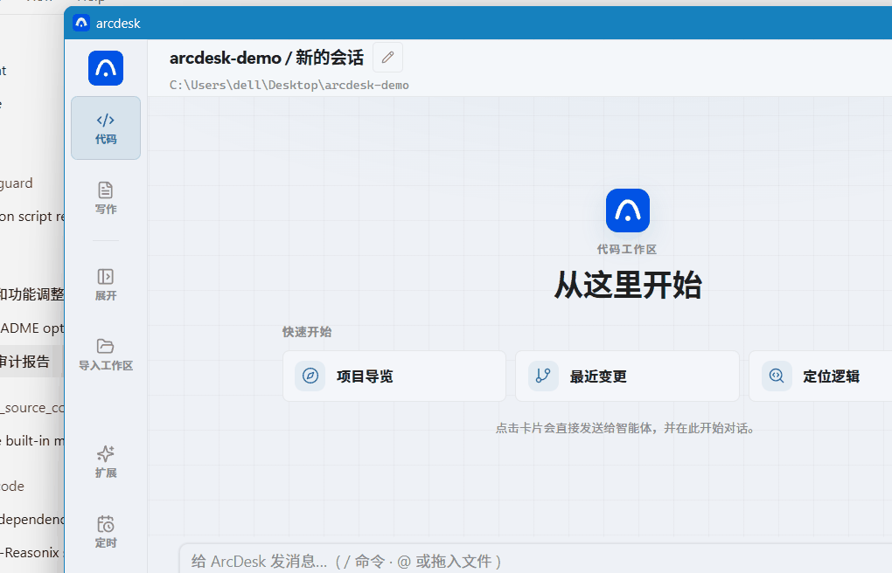

<p align="center">
  
</p>

<p align="center">
  <strong>Local DeepSeek desktop coding agent — read, edit, and run tools in a standalone window</strong><br/>
  No browser tab · tool approval · MCP / Skills · DeepSeek long-session cost tuning
</p>

<p align="center">
  <a href="./LICENSE"></a>
  <a href="https://github.com/P1ouson/deepseek-ArcDesk/releases"></a>
  <a href="https://github.com/P1ouson/deepseek-ArcDesk/stargazers"></a>
</p>

<p align="center">
  <a href="https://github.com/P1ouson/deepseek-ArcDesk/releases"><strong>Download</strong></a>
  &nbsp;·&nbsp;
  <a href="#preview">Preview</a>
  &nbsp;·&nbsp;
  <a href="#compare">Compare</a>
  &nbsp;·&nbsp;
  <a href="#quick-start">Quick start</a>
  &nbsp;·&nbsp;
  <a href="./README.md">简体中文</a>
  &nbsp;·&nbsp;
  <a href="./docs/SPEC.md">Spec</a>
  &nbsp;·&nbsp;
  <a href="./SECURITY.md">Security</a>
</p>

<br/>

## Preview {#preview}

<p align="center">
  <a href="https://github.com/P1ouson/deepseek-ArcDesk/releases">
    
  </a>
</p>
<p align="center"><sub>Import a project → welcome cards → one-click agent tasks · <a href="#screenshots">static shot</a></sub></p>

<p align="center">
  <a href="https://github.com/P1ouson/deepseek-ArcDesk/releases/latest/download/arcdesk-desktop-windows-amd64-installer.exe"><strong>Windows</strong></a>
  &nbsp;·&nbsp;
  <a href="https://github.com/P1ouson/deepseek-ArcDesk/releases">All releases</a>
</p>

> **Before first install**
>
> - **ArcDesk is an independent MIT project — not an official DeepSeek product.** Model usage is billed by your API provider.
> - **Prebuilt desktop installers are Windows-only for now.** macOS / Linux: build from source (see [`desktop/README.md`](./desktop/README.md)).
> - Windows installer is **not** Authenticode-signed yet — SmartScreen may prompt on first launch.
> - Windows setup **downloads WebView2** when missing (normal, a few MB).
> - Install to **`%LOCALAPPDATA%\Programs\ArcDesk`** or a new empty folder — **not** into a git checkout or dev tree.

<br/>

## Compare {#compare}

| | **ArcDesk** | **DeepSeek web** | **Cursor** | **Chat clients** |
|---|:---:|:---:|:---:|:---:|
| **Form** | Native desktop + CLI | Browser tab | IDE fork | Often Electron chat shell |
| **Agent workflow** | Files / bash / diff / approval | Chat-first | Deep IDE integration | Varies |
| **DeepSeek session cost** | Prefix-cache + compaction | No dedicated tuning | Multi-model subscription | Usually none |
| **MCP + per-project trust** | ✅ | ❌ | ✅ | Partial |
| **Open source** | MIT | ❌ | ❌ | Varies |
| **Standalone window** | ✅ default | ❌ | Inside IDE | ✅ |

Same agent loop family as Cursor (chat → tools → diff → approval), **not** a full IDE replacement. Pairs with VS Code, JetBrains, or your terminal.

**v0.1.7 highlights (Windows-only release):** P2 agent stack (RAG, guardian, task DAG, cost router, context compression), slash subcommand fixes with arg hints, Knowledge Studio + MCP/Skills marketplace modals, shared workspace runtime across tabs, compact sidebar at 850px default height. **v0.1.6:** maintainability refactor, Context cache savings estimate, Windows build fixes.

**v0.1.5:** multi-tab workspaces, token & cache metrics, scroll-to-bottom on session open, immediate background-task notices.

<br/>

## Screenshots {#screenshots}

<p align="center">
  
</p>

Sidebar also covers **Writing · Extensions (Skills / MCP) · Schedule · Connect (mobile remote) · Settings**. See the [Chinese README](./README.md#桌面亮点) for the full desktop feature list.

<br/>

## Quick start {#quick-start}

1. Install the **Windows** installer from [Releases](https://github.com/P1ouson/deepseek-ArcDesk/releases)
2. Paste your [DeepSeek API key](https://platform.deepseek.com/) (stored locally)
3. Import a project folder and describe your task

### CLI / from source {#cli}

**No npm package** from this repo. Build locally:

```sh
make build
./bin/arcdesk chat
./bin/arcdesk run "explain this repo"
```

Desktop from source: `cd desktop && wails build` · Windows installer: `desktop/scripts/build-windows-installer.ps1` (needs NSIS). See [`desktop/README.md`](./desktop/README.md).

<br/>

## vs Reasonix

The Go kernel builds on [**Reasonix**](https://github.com/esengine/DeepSeek-Reasonix). ArcDesk is **desktop-first**:

- **Native Wails shell** — sidebar, project drawer, inline diffs (not terminal TUI)
- **Windows release installer** — NSIS via GitHub Actions (`release-desktop.yml`); macOS / Linux prebuilts paused
- **Security hardening** — per-project MCP trust, sensitive-action prompts, workspace sandbox ([`SECURITY.md`](./SECURITY.md))
- **Migration** — `arcdesk.toml`, non-destructive import from `~/.reasonix/`

<br/>

## Configuration

TOML-driven: `./arcdesk.toml` (project) · `~/.config/arcdesk/config.toml` (user) · `.mcp.json` supported.

Full schema, permissions, slash commands, plugins → [`docs/SPEC.md`](./docs/SPEC.md) · example → [`docs/examples/arcdesk.example.toml`](./docs/examples/arcdesk.example.toml)

<br/>

## FAQ {#faq}

**ArcDesk vs ARCDESK?** — Same kernel; ArcDesk is the product name, ARCDESK is the CLI command.

**Free?** — MIT software; DeepSeek API billed by usage.

**Must use DeepSeek?** — **Recommended.** OpenAI-compatible `[[providers]]` work, but tuning targets DeepSeek.

**Must use the desktop?** — No; `ARCDESK chat` / `run` is enough.

<br/>

## Troubleshooting {#troubleshooting}

| Symptom | Fix |
|---------|-----|
| Windows SmartScreen | Expected for unsigned installers → *More info → Run anyway* (setup also installs WebView2) |
| Windows blank window | Install [WebView2](https://developer.microsoft.com/microsoft-edge/webview2/) manually |
| MCP not loading | Trust project/server in desktop UI; check `.mcp.json` |
| Uninstall left files behind | Install to a dedicated folder (not a dev tree); see latest installer release notes |

<br/>

## Docs

- [`docs/SPEC.md`](./docs/SPEC.md) — config, tools, MCP, permissions
- [`desktop/README.md`](./desktop/README.md) — desktop build & dev
- [`docs/screenshots/README.md`](./docs/screenshots/README.md) — capture hero GIF / PNG for README
- [`SECURITY.md`](./SECURITY.md) — security model
- [`docs/MIGRATING.md`](./docs/MIGRATING.md) — migrate from Reasonix / 0.x

<br/>

## Acknowledgments

Go agent kernel references [**Reasonix**](https://github.com/esengine/DeepSeek-Reasonix) and its contributors.

---

<p align="center">
  <sub>MIT — <a href="./LICENSE">LICENSE</a> · If ArcDesk helps you, consider a <a href="https://github.com/P1ouson/deepseek-ArcDesk">Star ⭐</a></sub>
</p>
