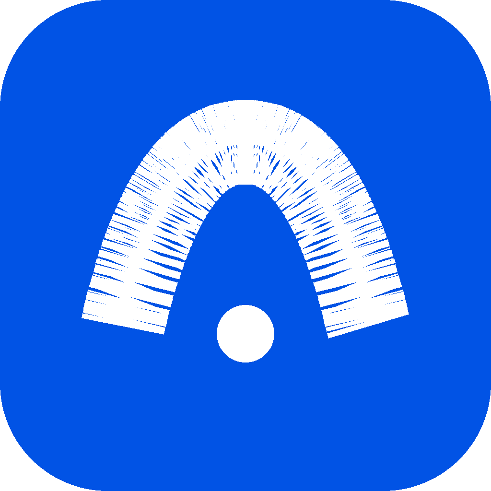

<p align="center">
  
</p>

<p align="center">
  <strong>ArcDesk</strong> — DeepSeek-native AI coding assistant (Windows desktop)
</p>

<p align="center">
  <a href="./README.md">简体中文</a>
  &nbsp;·&nbsp;
  <a href="https://github.com/P1ouson/ArcDesk/releases">Releases</a>
  &nbsp;·&nbsp;
  <a href="./SECURITY.md">Security</a>
  &nbsp;·&nbsp;
  <a href="./docs/SPEC.md">Spec</a>
</p>

<br/>

**ArcDesk** is a desktop coding agent built on a Go kernel: chat, file tools, inline diffs, MCP, and a project workbench. **Session design and cost control target [DeepSeek](https://platform.deepseek.com/) first** (prefix-cache-friendly long runs). Other OpenAI-compatible providers work via config, but tuning and economics may differ.

| | |
|---|---|
| **Shipped today** | **Windows** installer (~10 MB setup wizard, pick install folder) |
| **Kernel lineage** | [Reasonix](https://github.com/esengine/DeepSeek-Reasonix) Go agent loop |
| **License** | MIT ([`LICENSE`](./LICENSE)) |

<p align="center">
  
</p>

<p align="center">
  <a href="https://github.com/P1ouson/ArcDesk/releases/latest/download/arcdesk-desktop-amd64-installer.exe"><strong>Download Windows installer</strong></a>
</p>

<br/>

## Install (Windows)

1. Download **[arcdesk-desktop-amd64-installer.exe](https://github.com/P1ouson/ArcDesk/releases/latest/download/arcdesk-desktop-amd64-installer.exe)** from [Releases](https://github.com/P1ouson/ArcDesk/releases).
2. Run the setup wizard and choose an install folder (per-user default, **no admin**).
3. Launch **ArcDesk**, paste your DeepSeek API key, and **open a project folder**.

> **macOS / Linux desktop builds** are not published in this repo yet. Build from source via [`desktop/README.md`](./desktop/README.md).

> **SmartScreen** may block unsigned builds → *More info → Run anyway*. Requires [WebView2](https://developer.microsoft.com/microsoft-edge/webview2/) on Windows.

<br/>

## Quick start

1. Install and open ArcDesk  
2. Enter your [DeepSeek API key](https://platform.deepseek.com/) (stored locally)  
3. Open a project directory and describe your task  

<br/>

## FAQ

**Relation to ARCDESK / Reasonix?**  
**ArcDesk** is the desktop product in this repo. The CLI still uses `ARCDESK` / `arcdesk` and `arcdesk.toml`. The Go kernel references [Reasonix](https://github.com/esengine/DeepSeek-Reasonix) — see **Lineage** below.

**Is it free?**  
MIT-licensed software; you pay your model provider for API usage.

**Must I use DeepSeek?**  
**Recommended** — prefix-cache sessions and presets are optimized for DeepSeek. Other OpenAI-compatible `[[providers]]` entries are supported.

**MCP?**  
Yes — `.mcp.json` or `[[plugins]]` in `arcdesk.toml`. New repo-local servers require **per-project trust** in the desktop UI.

<br/>

## Build from source

```powershell
cd desktop
.\scripts\build-windows-installer.ps1   # needs NSIS
```

```sh
make build
cd desktop && wails build
```

See [`desktop/README.md`](./desktop/README.md).

<br/>

## Lineage — Reasonix

ArcDesk’s **Go agent kernel** builds on [**Reasonix**](https://github.com/esengine/DeepSeek-Reasonix). Thank you to the Reasonix project and contributors.

This repo adds desktop-first work: **Wails studio UI**, **Windows NSIS installer**, **security hardening**, and **ArcDesk branding** (`arcdesk.toml`, non-destructive import from `~/.reasonix/`).

Details: [`SECURITY.md`](./SECURITY.md).

<br/>

---

<p align="center">
  <sub>MIT · <a href="https://github.com/P1ouson/ArcDesk">P1ouson/ArcDesk</a></sub>
</p>
