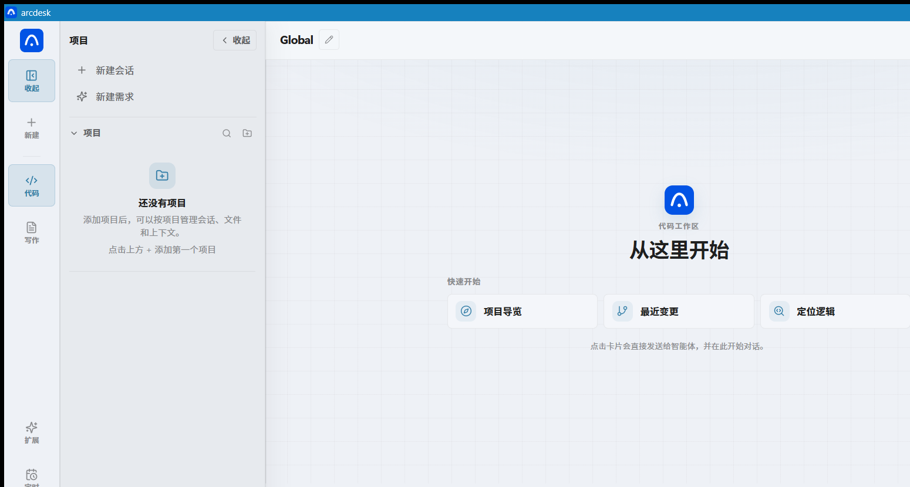

<p align="center">
  
</p>

<p align="center">
  <a href="./LICENSE"></a>
  <a href="https://github.com/P1ouson/deepseek-ArcDesk/releases"></a>
</p>

<p align="center">
  <strong>English</strong>
  &nbsp;·&nbsp;
  <a href="./README.md">简体中文</a>
  &nbsp;·&nbsp;
  <a href="https://github.com/P1ouson/deepseek-ArcDesk/releases">Releases</a>
  &nbsp;·&nbsp;
  <a href="./docs/SPEC.md">Spec</a>
  &nbsp;·&nbsp;
  <a href="./SECURITY.md">Security</a>
</p>

<br/>

**A DeepSeek-native coding agent — as a desktop app.** The same Go kernel powers the CLI (`ARCDESK`). Sessions are built around prefix-cache stability; tools, MCP, inline diffs, and project workspaces live in one native window.

> **Naming**: **ArcDesk** = product & desktop app · **ARCDESK** = CLI / config prefix (`ARCDESK.toml`)

<p align="center">
  <a href="https://github.com/P1ouson/deepseek-ArcDesk/releases">
    
  </a>
</p>

<p align="center">
  <a href="https://github.com/P1ouson/deepseek-ArcDesk/releases"><strong>Download installers</strong></a>
  &nbsp;&nbsp;·&nbsp;&nbsp;
  <a href="#cli">CLI / source</a>
  &nbsp;&nbsp;·&nbsp;&nbsp;
  <a href="#faq">FAQ</a>
</p>

<br/>

## Install

**Windows · macOS · Linux** — grab **installers** from [Releases](https://github.com/P1ouson/deepseek-ArcDesk/releases) (not the source zip).

| Platform | Installer | Notes |
|----------|-----------|-------|
| **Windows** | [`.exe`](https://github.com/P1ouson/deepseek-ArcDesk/releases/latest/download/arcdesk-desktop-windows-amd64-installer.exe) | Setup wizard, no admin |
| **macOS** | [`.dmg`](https://github.com/P1ouson/deepseek-ArcDesk/releases/latest/download/arcdesk-desktop-darwin-universal.dmg) | Drag to Applications |
| **Linux** | [`.tar.gz`](https://github.com/P1ouson/deepseek-ArcDesk/releases/latest/download/arcdesk-desktop-linux-amd64-installer.tar.gz) | Extract, run `./install.sh` |

1. Install and open **ArcDesk**
2. Paste your [DeepSeek API key](https://platform.deepseek.com/) (stored locally)
3. Open a project folder and describe your task

Linux: `tar -xzf arcdesk-desktop-linux-amd64-installer.tar.gz && ./install.sh && arcdesk-desktop`

> Installers are not code-signed (common for OSS). macOS / Windows may block first launch — see [Troubleshooting](#troubleshooting). On Linux, launch from the app menu; PATH changes are optional.

### CLI / from source {#cli}

**No npm package** from this repo. Build the CLI locally:

```sh
make build
./bin/arcdesk chat
./bin/arcdesk run "explain this repo"
```

Desktop from source: `cd desktop && wails build` · Windows installer: `desktop/scripts/build-windows-installer.ps1` (needs NSIS). See [`desktop/README.md`](./desktop/README.md).

<br/>

## Quick start

| Step | Desktop | CLI |
|------|---------|-----|
| 1 | Install platform installer | `make build` |
| 2 | Enter API key | `export DEEPSEEK_API_KEY=sk-...` or `ARCDESK setup` |
| 3 | Open project, describe task | `ARCDESK chat` or `ARCDESK run "..."` |

<br/>

## vs Reasonix

The Go kernel builds on [**Reasonix**](https://github.com/esengine/DeepSeek-Reasonix). ArcDesk is **desktop-first**:

- **Native Wails shell** — sidebar, project drawer, inline diffs (not terminal TUI)
- **Three-platform installers** — Windows NSIS / macOS dmg / Linux tar.gz via GitHub Actions
- **Security hardening** — per-project MCP trust, sensitive-action prompts, workspace sandbox ([`SECURITY.md`](./SECURITY.md))
- **Migration** — `arcdesk.toml`, non-destructive import from `~/.reasonix/`

<br/>

## Compare

| | **ArcDesk** | **Cursor** | **Claude Code** | **Reasonix** |
|---|:---:|:---:|:---:|:---:|
| **Form factor** | Desktop + CLI | IDE fork | CLI / plugin | Terminal / desktop (upstream) |
| **DeepSeek cost** | Prefix-cache sessions | Multi-model | Claude stack | **DeepSeek-focused** |
| **MCP** | stdio + HTTP | ecosystem | yes | yes |
| **License** | MIT | closed | closed | MIT |

<br/>

## Configuration

TOML-driven: `./ARCDESK.toml` (project) · `~/.config/arcdesk/config.toml` (user) · `.mcp.json` supported.

Full schema, permissions, slash commands, plugins → [`docs/SPEC.md`](./docs/SPEC.md) · example → [`ARCDESK.example.toml`](./ARCDESK.example.toml)

<br/>

## FAQ {#faq}

**ArcDesk vs ARCDESK?** — Same kernel; ArcDesk is the product name, ARCDESK is the CLI command.

**Free?** — MIT software; DeepSeek API billed by usage.

**Must use DeepSeek?** — **Recommended.** OpenAI-compatible `[[providers]]` work, but tuning targets DeepSeek.

**Must use the desktop?** — No; `ARCDESK chat` / `run` is enough.

<br/>

## Troubleshooting {#troubleshooting}

| Symptom | Fix |
|---------|-----|
| macOS "app is damaged" | `xattr -dr com.apple.quarantine /Applications/ArcDesk.app` |
| Windows SmartScreen | Expected for unsigned installers → *More info → Run anyway* (setup also installs WebView2) |
| Windows blank window | Install [WebView2](https://developer.microsoft.com/microsoft-edge/webview2/) manually |
| Linux command not found | Add `~/.local/bin` to PATH (not needed when launching from app menu) |
| Linux blank / flicker | WebKitGTK 4.1; try `WEBKIT_DISABLE_COMPOSITING_MODE=1` |
| MCP not loading | Trust project/server in desktop UI; check `.mcp.json` |

<br/>

## Docs

- [`docs/SPEC.md`](./docs/SPEC.md) — config, tools, MCP, permissions
- [`desktop/README.md`](./desktop/README.md) — desktop build & dev
- [`SECURITY.md`](./SECURITY.md) — security model
- [`docs/MIGRATING.md`](./docs/MIGRATING.md) — migrate from Reasonix / 0.x

<br/>

## Acknowledgments

Go agent kernel references [**Reasonix**](https://github.com/esengine/DeepSeek-Reasonix) and its contributors.

---

<p align="center">
  <sub>MIT — <a href="./LICENSE">LICENSE</a> · <a href="https://github.com/P1ouson/deepseek-ArcDesk">P1ouson/deepseek-ArcDesk</a></sub>
</p>
