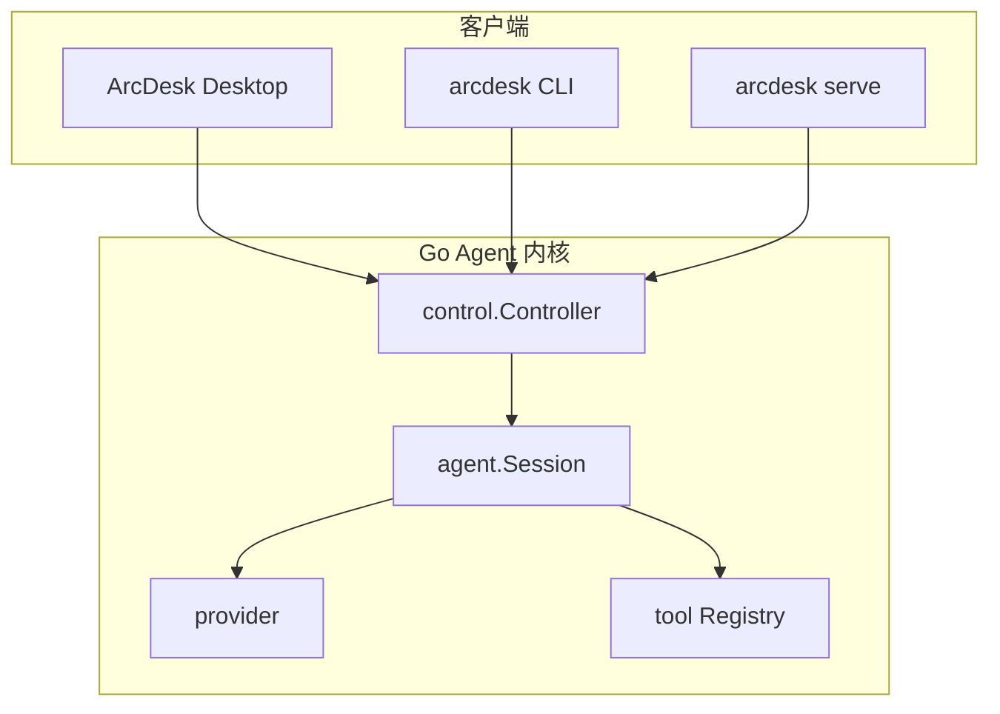

<p align="center">
  
</p>

<h1 align="center">ArcDesk</h1>

<p align="center">
  <strong>不止聊天：工具齐全的 DeepSeek 桌面 Agent</strong><br/>
  读文件 · 改代码 · 跑命令 · 接 MCP/Skills — 一个窗口配齐工具链，每一步你可审批
</p>

<!-- 荣誉勋章 · shields.io -->
<p align="center">
  <a href="https://github.com/P1ouson/deepseek-ArcDesk/releases">
    
  </a>
  <a href="./LICENSE">
    
  </a>
  <a href="https://github.com/P1ouson/deepseek-ArcDesk/stargazers">
    
  </a>
  <a href="https://github.com/P1ouson/deepseek-ArcDesk/issues">
    
  </a>
</p>

<p align="center">
  <a href="https://github.com/P1ouson/deepseek-ArcDesk/releases"><strong>⬇ 下载桌面版</strong></a>
  &nbsp;·&nbsp;
  <a href="#demo">预览</a>
  &nbsp;·&nbsp;
  <a href="#技术栈">技术栈</a>
  &nbsp;·&nbsp;
  <a href="#使用前须知">须知</a>
  &nbsp;·&nbsp;
  <a href="#安装">安装</a>
  &nbsp;·&nbsp;
  <a href="#快速开始">快速开始</a>
  &nbsp;·&nbsp;
  <a href="#参与贡献">贡献</a>
  &nbsp;·&nbsp;
  <a href="README.en.md">English</a>
</p>

<br/>

## 描述

**ArcDesk** 是一款开源、桌面优先的 **Coding Agent**：在独立原生窗口里让 AI 读取代码库、编辑文件、执行 shell 命令，并提供 Diff 审阅与工具审批流程。

与 Cursor 同类的是 **Agent 循环**（对话 → 工具 → Diff → 审批），但不是 VS Code 分支，也不试图替代专业 IDE——可与 VS Code、JetBrains 或终端并行使用。

| 对比 | ArcDesk | 网页版 DeepSeek | Cursor |
|:---:|:---:|:---:|:---:|
| 形态 | 原生桌面 + CLI | 浏览器标签 | IDE 分支 |
| Agent 工作流 | 读文件 / bash / Diff / 审批 | 以对话为主 | 深度 IDE 集成 |
| 工具链深度 | 内置工具 + MCP + Skills + 项目记忆 | 基本无工具 | IDE 内置 + 插件 |
| DeepSeek 长会话成本 | 前缀缓存 + 压缩策略 | 无专门优化 | 多模型订阅 |
| MCP + 项目级信任 | ✅ | ❌ | ✅ |

**适合：** 想要「能动手」而不只是聊天的开发者 — 工具链要全、DeepSeek 长会话要省、每一步工具调用要能审批。

**不适合：** 需要完整 IDE 一站式替代、只要单行补全、或不愿配置 API Key 的用户。

<br/>

## Demo

<p align="center">
  
</p>

<p align="center"><sub>导入工作区 → 一条 Prompt → <code>list_dir</code> · <code>write_file</code> · <code>bash</code> 工具链依次执行</sub></p>

<p align="center">
  <a href="https://github.com/P1ouson/deepseek-ArcDesk/releases/latest/download/arcdesk-desktop-windows-amd64-installer.exe"><strong>⬇ Windows</strong></a>
  &nbsp;·&nbsp;
  <a href="https://github.com/P1ouson/deepseek-ArcDesk/releases">全部 Release</a>
</p>

<br/>

## 技术栈

| 分层 | 技术 |
|------|------|
| **Frontend（桌面 UI）** | React 18 · TypeScript · Vite · xterm.js · react-markdown |
| **Desktop Shell** | [Wails v2](https://wails.io/)（WebView2 / WebKitGTK） |
| **Backend / Agent 内核** | Go 1.25+ · 单静态二进制（CLI `CGO_ENABLED=0`） |
| **AI / Model** | Provider 抽象；`openai`（DeepSeek、MiMo 等）、`anthropic` |
| **协议与扩展** | MCP（stdio + HTTP）· Skills · Hooks · ACP · HTTP/SSE `serve` |
| **构建与发布** | `make` · `goreleaser` · `wails build` · pnpm · NSIS |

<br/>

## 使用前须知

> 以下是你上手前最容易踩坑的几点 —— 建议先读一遍。

| 陷阱 | 说明 |
|------|------|
| **非 DeepSeek 官方产品** | ArcDesk 是独立 MIT 开源项目；模型推理按 API 用量计费 |
| **安装包未签名** | 当前构建尚未 Apple 公证 / Windows Authenticode 签名；macOS 可能提示「已损坏」，Windows 可能出现 SmartScreen |
| **Windows WebView2** | 安装程序会在缺失时自动下载 WebView2（约数 MB，属正常行为） |
| **安装路径** | 请选 `%LOCALAPPDATA%\Programs\ArcDesk` 或新建空文件夹；**不要**装到含 `.git` 的开发目录 |
| **MCP 默认隔离** | 项目 `.mcp.json` 中的服务器需在桌面 UI 中按项目**显式信任**后才加载 |
| **YOLO 模式门槛** | 全自动工具模式需先配置项目沙盒（`project-sandbox.json`） |
| **长工具输出截断** | 单次工具返回超过约 32KB 时会保留首尾片段，需用 `read_file` 分段继续读 |

**故障排查速查：**

| 现象 | 处理 |
|------|------|
| macOS「应用已损坏」 | `xattr -dr com.apple.quarantine /Applications/ArcDesk.app` |
| Windows SmartScreen | 更多信息 → 仍要运行；必要时安装 [WebView2](https://developer.microsoft.com/microsoft-edge/webview2/) |
| Linux 空白 / 闪烁 | 安装 WebKitGTK 4.1；可试 `WEBKIT_DISABLE_COMPOSITING_MODE=1` |
| MCP 未加载 | 在桌面 UI 信任项目 MCP；检查 `.mcp.json` 与 `arcdesk.toml` |

<br/>

## 安装

### 方式一：桌面版（推荐）

支持 **Windows · macOS · Linux (amd64)**。从 [Releases](https://github.com/P1ouson/deepseek-ArcDesk/releases) 下载**安装包**（非 Source code zip）。

| 平台 | 安装包 |
|------|--------|
| **Windows** | [`arcdesk-desktop-windows-amd64-installer.exe`](https://github.com/P1ouson/deepseek-ArcDesk/releases/latest/download/arcdesk-desktop-windows-amd64-installer.exe) |
| **macOS** | [`arcdesk-desktop-darwin-universal.dmg`](https://github.com/P1ouson/deepseek-ArcDesk/releases/latest/download/arcdesk-desktop-darwin-universal.dmg) |
| **Linux** | [`arcdesk-desktop-linux-amd64-installer.tar.gz`](https://github.com/P1ouson/deepseek-ArcDesk/releases/latest/download/arcdesk-desktop-linux-amd64-installer.tar.gz) |

### 方式二：CLI（源码构建）

**依赖：** Go 1.25+、Git

```bash
git clone https://github.com/P1ouson/deepseek-ArcDesk.git
cd deepseek-ArcDesk
make build          # 输出 bin/ARCDESK（Windows: ARCDESK.exe）
```

### 方式三：从源码构建桌面

**依赖：** Go · Node.js · pnpm · Wails CLI · 平台 WebView 库

```bash
cd desktop
wails dev            # 开发热重载
wails build          # → build/bin/arcdesk-desktop
```

Windows 本地快速构建（跳过 NSIS 安装包）：

```powershell
powershell -File build-dev.ps1
```

详见 [`desktop/README.md`](desktop/README.md)。

<br/>

## 快速开始

### 桌面版 · 5 分钟

1. 安装对应平台安装包并启动 **ArcDesk**
2. 在设置中粘贴 [DeepSeek API Key](https://platform.deepseek.com/)（保存在本地凭证存储）
3. **导入工作区** — 选择项目文件夹
4. 在输入框描述任务，例如：`阅读 README 并列出主要模块`
5. 对工具调用（写文件、bash 等）在审批 UI 中确认

### CLI · 5 分钟

```bash
export DEEPSEEK_API_KEY=sk-...        # 或 arcdesk setup 交互写入
./bin/ARCDESK setup                   # 生成 ~/.config/arcdesk/config.toml

cd your-project
./bin/ARCDESK chat                    # 交互 TUI
# 或
./bin/ARCDESK run "解释这个仓库的目录结构"
```

> Windows PowerShell 将 `./bin/ARCDESK` 替换为 `.\bin\ARCDESK.exe`。

### 最小配置示例

```toml
# arcdesk.toml
default_model = "deepseek"

[[providers]]
name        = "deepseek"
kind        = "openai"
base_url    = "https://api.deepseek.com"
models      = ["deepseek-v4-flash", "deepseek-v4-pro"]
default     = "deepseek-v4-flash"
api_key_env = "DEEPSEEK_API_KEY"
context_window = 1000000

[agent]
max_steps = 25
compact_ratio = 0.8

[permissions]
mode  = "ask"
deny  = ["bash(rm -rf*)"]
```

完整 schema → [`docs/SPEC.md`](docs/SPEC.md) · 完整示例 → [`docs/examples/arcdesk.example.toml`](docs/examples/arcdesk.example.toml)

<br/>

## 功能亮点

| 能力 | 说明 |
|------|------|
| **代码工作区** | 多标签并行；auto / plan / yolo 三档；Token / 缓存用量可见 |
| **写作工作区** | 独立文稿模式，可联动 Skills 做文档类任务 |
| **Agent 扩展** | Skills + MCP；内置 explore / research / review / security-review |
| **内联 Diff + 审批** | 写文件 / bash / MCP 调用需确认；变更以 Diff 展示 |
| **手机远程连接** | 扫码配对 · 局域网 · Cloudflare 穿透 |
| **定时任务** | 后台到期自动开聊并发 Prompt |
| **集成终端** | 多 Tab PTY（xterm.js） |
| **记忆库** | 管理 `ARCDESK.md` 层级记忆，长会话前缀稳定 |
| **CLI 同源内核** | `arcdesk chat` / `run` / `serve` 与桌面共享 `control.Controller` |

<br/>

## 项目结构

```
deepseek-ArcDesk/
├── cmd/arcdesk/           # CLI 入口（chat / run / setup / serve …）
├── internal/
│   ├── agent/             # Agent 循环与会话
│   ├── control/           # 传输无关控制器（桌面 / CLI / HTTP 共用）
│   ├── provider/          # 模型后端
│   ├── tool/builtin/      # 内置工具
│   └── plugin/            # MCP 客户端
├── desktop/               # Wails 桌面应用
│   ├── app.go             # Go ↔ React 绑定
│   └── frontend/          # React UI
├── docs/                  # SPEC、示例配置、截图、变更记录
├── Makefile
└── README.md
```

<br/>

## 架构概览

桌面、CLI 与 HTTP 服务共享同一 Agent 内核，UI 层仅负责绑定与事件渲染。



<br/>

## 参与贡献

欢迎贡献！请先阅读 [`CONTRIBUTING.md`](CONTRIBUTING.md)。

```bash
git clone https://github.com/P1ouson/deepseek-ArcDesk.git
cd deepseek-ArcDesk
make build && make test && make vet
```

**Commit 规范：** [Conventional Commits](https://www.conventionalcommits.org/)（如 `feat(desktop): …` · `fix: …` · `docs: …`）

**PR 流程：**

1. Fork 仓库，从 `main` 切分支
2. 行为变更需附测试
3. 确保 `make test` 与 `make vet` 通过
4. 桌面 UI 变更需在 `desktop/frontend` 通过 `pnpm exec tsc --noEmit`

**安全漏洞：** 请勿公开 Issue，见 [`SECURITY.md`](SECURITY.md)。

<br/>

## 相关文档

| 文档 | 说明 |
|------|------|
| [`docs/README.md`](docs/README.md) | 文档索引 |
| [`docs/SPEC.md`](docs/SPEC.md) | 配置 schema、工具、MCP、权限 |
| [`docs/CHANGELOG.md`](docs/CHANGELOG.md) | 版本变更 |
| [`desktop/README.md`](desktop/README.md) | 桌面构建与开发 |
| [`docs/MIGRATING.md`](docs/MIGRATING.md) | 从 Reasonix / 旧版迁移 |
| [`SECURITY.md`](SECURITY.md) | 安全模型与漏洞报告 |

<br/>

## 开源协议

[MIT](LICENSE) © ArcDesk contributors

---

<p align="center">
  <sub>如果 ArcDesk 对你有帮助，欢迎 <a href="https://github.com/P1ouson/deepseek-ArcDesk">Star ⭐</a> 支持项目</sub>
</p>
