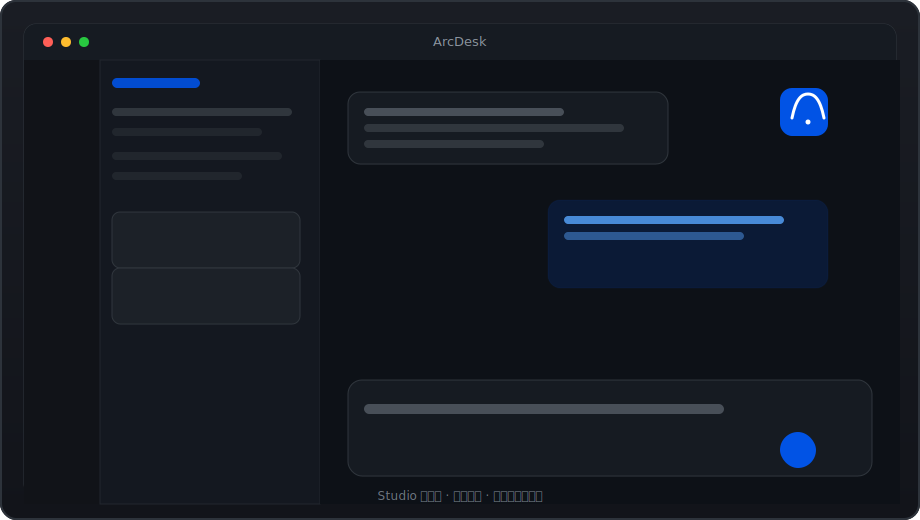

<p align="center">
  
</p>

<p align="center">
  <a href="https://www.npmjs.com/package/ARCDESK"></a>
  <a href="./LICENSE"></a>
  <a href="https://github.com/esengine/DeepSeek-ARCDESK/stargazers"></a>
  <a href="https://github.com/esengine/DeepSeek-ARCDESK/actions/workflows/ci.yml"></a>
  <a href="https://discord.gg/XF78rEME2D"></a>
</p>

<p align="center">
  <a href="./README.zh-CN.md">简体中文</a>
  &nbsp;·&nbsp;
  <a href="https://github.com/esengine/DeepSeek-ARCDESK/releases">Releases</a>
  &nbsp;·&nbsp;
  <a href="./docs/SPEC.md">Docs</a>
  &nbsp;·&nbsp;
  <a href="./SECURITY.md">Security</a>
  &nbsp;·&nbsp;
  <a href="./CONTRIBUTING.md">Contributing</a>
  &nbsp;·&nbsp;
  <a href="https://discord.gg/XF78rEME2D">Discord</a>
</p>

<br/>

# ArcDesk

**MIT-licensed DeepSeek-native coding agent — native desktop app and CLI, one Go kernel.**

Run long agent sessions without paying full context price every turn. **ArcDesk** is the desktop product; **`ARCDESK`** is the CLI binary and config namespace (`ARCDESK.toml`, `ARCDESK chat`). Both share the same engine.

| | |
|---|---|
| **Desktop-first** | Windows · macOS · Linux — chat, tools, inline diffs, project workspace |
| **DeepSeek economics** | Prefix-cache–friendly append-only sessions; optional executor + planner split |
| **Open & local** | MCP (stdio + HTTP), `.mcp.json`, TOML permissions, MIT source you can read |

<p align="center">
  <a href="https://github.com/esengine/DeepSeek-ARCDESK/releases">
    
  </a>
</p>

<p align="center">
  <a href="https://github.com/esengine/DeepSeek-ARCDESK/releases"><strong>Download desktop</strong></a>
  &nbsp;&nbsp;·&nbsp;&nbsp;
  <a href="#cli-install"><strong>Install CLI</strong></a>
  &nbsp;&nbsp;·&nbsp;&nbsp;
  <a href="./docs/SPEC.md"><strong>Read the spec</strong></a>
  &nbsp;&nbsp;·&nbsp;&nbsp;
  <a href="#faq"><strong>FAQ</strong></a>
</p>

<br/>

## Quick install

### Desktop

| Platform | Download |
|----------|----------|
| **Windows** | [`.exe` installer](https://github.com/esengine/DeepSeek-ARCDESK/releases/latest/download/arcdesk-desktop-amd64-installer.exe) (small setup wizard) |
| **macOS** | [Universal `.dmg`](https://github.com/esengine/DeepSeek-ARCDESK/releases/latest/download/ARCDESK-darwin-universal.dmg) |
| **Linux** | [`.tar.gz` (amd64)](https://github.com/esengine/DeepSeek-ARCDESK/releases/latest/download/ARCDESK-linux-amd64.tar.gz) |

1. Download for your platform from the table or **[GitHub Releases](https://github.com/esengine/DeepSeek-ARCDESK/releases)**.
2. Open **ArcDesk** and paste a [DeepSeek API key](https://platform.deepseek.com/) in the setup overlay (stored locally).
3. **Open a project folder** and start a task.

Checksums and **minisign** signatures ship with every release. Verify downloads: [`desktop/README.md`](./desktop/README.md#verifying-a-download) · [`SECURITY.md`](./SECURITY.md).

> **First launch:** macOS Gatekeeper and Windows SmartScreen may block unsigned builds — see [Troubleshooting](#troubleshooting).

### CLI install

```sh
npm i -g ARCDESK
```

Ships a single native **Go binary** (Node is only the installer). Optional: `brew install esengine/ARCDESK/ARCDESK` on macOS.

<br/>

## 60-second quick start

**Desktop** — install → API key → open project → type a task.

**CLI**

```sh
export DEEPSEEK_API_KEY=sk-...     # or: ARCDESK setup
ARCDESK chat                       # interactive TUI
ARCDESK run "explain this repo"    # one-shot run
```

<br/>

## Why ArcDesk?

| | **ArcDesk** | **Cursor** | **Cline / Roo** | **Claude Code** | **OpenCode** |
|---|:---:|:---:|:---:|:---:|:---:|
| **Desktop app** | Native (Wails) | VS Code fork | Extension in editor | CLI / plugins | Terminal-first |
| **DeepSeek / cost** | Prefix-cache session design | Multi-model IDE | Model-agnostic | Claude stack | Model-agnostic CLI |
| **MCP** | stdio + HTTP; `.mcp.json` | Ecosystem | Yes | MCP support | Varies |
| **Control** | TOML, permissions, sandbox | Account policies | Extension settings | Anthropic account | Config / env |
| **Best for** | **Standalone OSS desktop + CLI** tuned for DeepSeek | All-in-one proprietary IDE | Stay inside VS Code | Anthropic terminal workflow | Minimal terminal agent |

**Choose ArcDesk** if you want an inspectable MIT agent with a **real desktop app** (not only an editor plugin), **MCP**, and a **CLI on the same kernel** — optimized for **DeepSeek long-session cost**, not vendor IDE lock-in.

<br/>

## Security & trust

Defaults lean **ask before action**. Summary:

| Layer | What you get |
|-------|----------------|
| **MCP trust** | Repo `.mcp.json` servers **quarantined** until you trust them per project |
| **Native confirmations** | Credentials, MCP install, tunnels, LAN, high-risk shell → **OS dialog** |
| **Tool permissions** | `allow` / `ask` / `deny`; writers prompt in chat; `deny` always wins |
| **Workspace sandbox** | Writers stay under project root; macOS `bash` jailed by default |
| **Signed updates** | Windows/Linux: **minisign + SHA256** before apply |

Details: [`SECURITY.md`](./SECURITY.md) · [`desktop/README.md`](./desktop/README.md) · [`docs/SPEC.md`](./docs/SPEC.md) §9.

<br/>

## FAQ {#faq}

<details>
<summary><strong>What's the difference between ArcDesk and ARCDESK?</strong></summary>

**ArcDesk** is the product name and **desktop app**. **ARCDESK** is the CLI command, npm package, and config prefix (`ARCDESK.toml`, `.ARCDESK/`). Same Go kernel underneath.
</details>

<details>
<summary><strong>Is ArcDesk free?</strong></summary>

The software is **MIT-licensed and free**. You pay your **model provider** (e.g. DeepSeek API usage). No ArcDesk subscription.
</details>

<details>
<summary><strong>Do I need the desktop app, or can I use CLI only?</strong></summary>

Either. Desktop is the recommended surface for diffs and tool visibility; **`ARCDESK chat`** / **`ARCDESK run`** use the identical engine and config.
</details>

<details>
<summary><strong>Can I use models other than DeepSeek?</strong></summary>

Yes — any **OpenAI-compatible** endpoint works as a `[[providers]]` entry in `ARCDESK.toml`. **The kernel is engineered primarily for DeepSeek** (prefix-cache sessions, flash/pro presets, long-run cost control). Other models are supported; economics and tuning may differ.
</details>

<details>
<summary><strong>Where are API keys stored?</strong></summary>

CLI: environment variables (`api_key_env` in config). Desktop: local app credential store on first-run setup. Keys are **not** written into TOML config files.
</details>

<details>
<summary><strong>Does it work with my existing MCP setup?</strong></summary>

Drop **`.mcp.json`** in the project root — field mapping matches `[[plugins]]`. New repo-local servers are **quarantined** until you explicitly trust them.
</details>

<details>
<summary><strong>How do updates work?</strong></summary>

Desktop checks release metadata on startup. **Linux/Windows** auto-update after minisign + SHA256 verification. **macOS** downloads manually until notarization lands. See [`desktop/README.md`](./desktop/README.md).
</details>

<details>
<summary><strong>I'm on 0.x TypeScript — what changed?</strong></summary>

**1.0+** is a Go rewrite on `main-v2`. Legacy **0.x** lives on [`v1`](https://github.com/esengine/DeepSeek-ARCDESK/tree/v1). `npm i -g ARCDESK` still works; see [`docs/MIGRATING.md`](./docs/MIGRATING.md).
</details>

<br/>

## Troubleshooting

| Symptom | Fix |
|---------|-----|
| **macOS: "app is damaged" / unidentified developer** | `xattr -dr com.apple.quarantine /Applications/ARCDESK.app` — see [`desktop/README.md`](./desktop/README.md) |
| **Windows: SmartScreen blocked** | *More info → Run anyway* (unsigned build) |
| **Windows: blank window** | Install [WebView2 runtime](https://developer.microsoft.com/microsoft-edge/webview2/) |
| **Linux: blank / flickering UI** | Install WebKitGTK 4.1; try `WEBKIT_DISABLE_COMPOSITING_MODE=1` — see [`desktop/README.md`](./desktop/README.md) |
| **`ARCDESK: command not found` after npm** | Ensure npm global bin is on `PATH`; reinstall: `npm i -g ARCDESK` |
| **401 / invalid API key** | Set `DEEPSEEK_API_KEY` or re-enter key in desktop setup; check provider `base_url` / model name |
| **MCP server not loading** | Trust the project/server in desktop UI; check `.mcp.json` syntax and env vars |
| **Tool call blocked** | Review `[permissions]` in `ARCDESK.toml` — `deny` rules hard-block everywhere |

Still stuck? [Discussions](https://github.com/esengine/DeepSeek-ARCDESK/discussions) · [Discord](https://discord.gg/XF78rEME2D) · [open an issue](https://github.com/esengine/DeepSeek-ARCDESK/issues/new/choose) (non-security).

<br/>

---

> **Naming:** **ArcDesk** = product · **ARCDESK** = CLI / config · Repo: [`esengine/DeepSeek-ARCDESK`](https://github.com/esengine/DeepSeek-ARCDESK)

<br/>

## Features

- **Config-driven.** Providers, the agent, enabled tools, and plugins are all
  declared in `ARCDESK.toml`. No hardcoded models.
- **Multi-model & composable.** DeepSeek (flash/pro) and MiMo ship as presets;
  OpenAI-compatible endpoints also work, but **long-session cost and cache design
  target DeepSeek first**. Optionally run two models together (executor + planner)
  in separate, cache-stable sessions.
- **Plugin-driven.** External tools run as subprocesses over stdio JSON-RPC
  (MCP-compatible). Built-in tools self-register at compile time.
- **Zero-friction distribution.** `CGO_ENABLED=0` single binary for CLI; cross-compile
  to six targets with one command. Desktop builds are platform-native (Wails).

## Build from source

```sh
make build      # -> bin/ARCDESK(.exe)
make cross      # -> dist/ (darwin|linux|windows × amd64|arm64)
cd desktop && wails build   # -> desktop app (see desktop/README.md)
```

## Configuration

Resolution order: **flag > `./ARCDESK.toml` > `~/.config/ARCDESK/config.toml` >
built-in defaults**. Secrets come from the environment via `api_key_env` and are
never stored in config files.

```toml
default_model = "deepseek-flash"   # executor; set [agent].planner_model to add a planner
# language    = "zh"               # ui language; empty = auto-detect from $LANG / $ARCDESK_LANG

[agent]
# planner_model = "mimo-pro"          # optional low-frequency planner
# subagent_model = "deepseek-pro"     # optional default for runAs=subagent skills
# subagent_models = { review = "deepseek-pro", security_review = "deepseek-pro" }
auto_plan = "off"                  # off|on; off keeps plan mode manual
# auto_plan_classifier = "deepseek-flash"   # optional; only borderline tasks call it

[[providers]]
name        = "deepseek-flash"
kind        = "openai"
base_url    = "https://api.deepseek.com"
model       = "deepseek-v4-flash"
api_key_env = "DEEPSEEK_API_KEY"
# also preset: deepseek-pro, mimo-pro (mimo-v2.5-pro), mimo-flash (mimo-v2-flash) @ api.xiaomimimo.com/v1

[tools]
enabled = []   # omit/empty = all built-ins

[skills]
# paths = ["~/my-skills", "../shared/skills"]   # extra custom skill roots
# disabled_skills = ["review"]                  # hide skills until /skill enable <name>

[permissions]
mode  = "ask"                                # writer fallback when no rule matches: ask|allow|deny
deny  = ["bash(rm -rf*)", "bash(git push*)"] # hard-blocked in every mode
allow = ["bash(go test*)"]                   # never prompted

[sandbox]
# workspace_root = ""          # file-writers confined here; empty = current dir
# allow_write    = ["/tmp"]    # extra dirs write_file/edit_file/multi_edit may touch

[[plugins]]
name    = "example"
command = "ARCDESK-plugin-example"
```

Permissions gate each tool call: `deny` > `ask` > `allow` > fallback (readers
always allow; writers fall back to `mode`). `ARCDESK chat` prompts before writers
(`y` once · `a` this session · `n` no); `ARCDESK run` stays autonomous but still
honours `deny`. See [`docs/SPEC.md`](docs/SPEC.md) for the full schema and contract.

Permissions are *policy* (which calls to allow / prompt). The **sandbox** is
*enforcement*: the file-writers (`write_file` / `edit_file` / `multi_edit`)
refuse any path outside `[sandbox] workspace_root` (default: the current dir, so
edits stay in the project), resolving symlinks and `..` so a link can't tunnel
out. Reads are unrestricted. `bash` is itself jailed on macOS by default
(`[sandbox] bash`, Seatbelt): commands may write only those same roots (plus
temp and toolchain caches) and reach the network only when `[sandbox] network`
is set. Other platforms fall back to running unconfined for now (see
`docs/SPEC.md` §9 for the escape-prompt and Linux support still to come).

### Plugins (MCP)

ARCDESK is an MCP client. A `[[plugins]]` entry's `type` selects the transport:
`stdio` (default) launches a local subprocess (`command`/`args`/`env`); `http`
(Streamable HTTP) connects to a remote `url` with optional static `headers`
(`${VAR}` / `${VAR:-default}` expanded from the environment, so tokens stay out
of the file). Tools surface to the model as `mcp__<server>__<tool>`; a tool
declaring MCP's `readOnlyHint: true` joins parallel dispatch and the permission
reader-default.

A server's **prompts** surface as `/mcp__<server>__<prompt>` slash commands
(positional args after the command); its **resources** are pulled in by writing
`@<server>:<uri>` in a message; `/mcp` lists connected servers and what each
exposes. `make build` also produces `bin/ARCDESK-plugin-example` — a runnable
reference stdio server (`echo`, `wordcount`, a `review` prompt, a style-guide
resource) you can copy.

```toml
[[plugins]]                       # local stdio server
name    = "example"
command = "ARCDESK-plugin-example"

[[plugins]]                       # remote server over Streamable HTTP
name    = "stripe"
type    = "http"
url     = "https://mcp.stripe.com"
headers = { Authorization = "Bearer ${STRIPE_KEY}" }
```

**Already have an `.mcp.json`?** Drop it in the project root and ARCDESK
reads it as-is — the `mcpServers` spec (`command`/`args`/`env`, `type`/`url`/
`headers`, `${VAR}` expansion) maps field-for-field onto `[[plugins]]`. Both
sources are merged; on a name collision `ARCDESK.toml` wins.

```json
{
  "mcpServers": {
    "filesystem": { "command": "npx", "args": ["-y", "@modelcontextprotocol/server-filesystem", "/path"] },
    "stripe": { "type": "http", "url": "https://mcp.stripe.com", "headers": { "Authorization": "Bearer ${STRIPE_KEY}" } }
  }
}
```

**Upgrading from `0.x`?** Your old `~/.ARCDESK/config.json` is still read for its
`mcpServers` (honouring `mcpDisabled`) as a lowest-priority source, so MCP servers
keep working — move them into `ARCDESK.toml`'s `[[plugins]]` or a `.mcp.json` when
convenient.

### Slash commands

In `ARCDESK chat`, built-in commands (`/compact`, `/new`, `/rewind`, `/tree`,
`/branch`, `/switch`, `/todo`, `/model`, `/effort`, `/mcp`, `/memory`, `/help`) run locally.
`/tree` shows saved conversation branches, `/branch [name]` forks the current
conversation tip, `/branch <turn> [name]` forks from an earlier checkpointed turn,
and `/switch <id|name>` loads another branch. **Custom commands** are Markdown files under
`.ARCDESK/commands/` (project) or `~/.config/ARCDESK/commands/` (user) —
`review.md` becomes `/review`, a subdirectory namespaces it (`git/commit.md` →
`/git:commit`). The body is a prompt template; invoking the command sends it as a
turn.

```markdown
---
description: Review the staged diff
argument-hint: [focus-area]
---
Review the staged diff. Focus on $ARGUMENTS, list bugs with file:line.
```

`$ARGUMENTS` expands to all space-separated args, `$1`…`$N` to positional ones.
MCP prompts also appear here as `/mcp__<server>__<prompt>`.

### @ references

Embed `@` references in a message and ARCDESK resolves them before sending, as
tagged context blocks: `@path/to/file` (or `@dir`) injects a local file's
contents (or a directory listing), and `@<server>:<uri>` injects an MCP
resource. A local path is only treated as a reference when it actually exists,
so ordinary `@mentions` stay literal. Typing `/` or `@` opens an autocomplete
menu — slash commands, or hierarchical file navigation (one directory level at a
time, descend into folders) plus MCP resources.

### Two-model collaboration (optional)

`ARCDESK setup` keeps first-run minimal: pick provider → keys (every SKU of a
chosen provider is enabled). Running two models together (executor + planner,
separate cache-stable sessions) is a one-line edit afterwards — set
`planner_model` to any other enabled provider:

```toml
[agent]
planner_model = "deepseek-pro"   # used as the low-frequency planner
```

Subagent skills inherit the executor model by default. Set `subagent_model` to
run them on another configured model, or use `subagent_models` to override only
specific skills such as `review` or `security_review`.

For interactive frontends, plan mode is manual by default. Set
`agent.auto_plan = "on"` to make complex-looking tasks enter plan mode
automatically: ARCDESK first drafts a read-only plan, then waits for approval
before editing or running side-effecting commands. `auto_plan_classifier` can
name a cheap provider such as `deepseek-flash`; it is only called for borderline
inputs and falls back to the heuristic if classification fails. Use
`/auto-plan off|on` in `ARCDESK chat` to change the user-level setting, or
`ARCDESK config auto-plan off|on` from a shell/script. Pass `--local` to the
shell command only when you intentionally want a project-local override.

## Architecture

Three tiers of extensibility, all behind registries the core resolves by name:

1. **Registry** — `Provider` and `Tool` are interfaces; the core has no
   `switch model`.
2. **Compile-time built-ins** — providers (`provider/openai`) and tools
   (`tool/builtin`) self-register via `init()`; `main` blank-imports them.
   Adding a built-in is one file plus one import.
3. **Runtime plugins** — executables declared in config, spoken to over
   newline-delimited JSON-RPC 2.0 on stdin/stdout (the MCP stdio convention).
   Each remote tool is adapted to the `Tool` interface.

## Status

Done: registry-based providers/tools, OpenAI-compatible streaming with tool
calls (bounded retry on 429/5xx), built-in tools (read_file, write_file,
edit_file, multi_edit, bash, ls, glob, grep, web_fetch, task, todo_write, ask),
TOML config, an interactive `ARCDESK setup` wizard, two-model collaboration
(executor + planner in separate, cache-stable sessions), low-frequency context
compaction, sub-agents (`task`), a bubbletea chat TUI (markdown, plan mode with
controller-driven approval, live token/activity readout, pinned task list,
`ask` question chooser, `/compact` `/new` `/tree` `/branch` `/switch` `/todo`), session persistence + resume,
per-call **permissions** (allow/ask/deny rules; chat prompts before writers, deny
rules hard-block everywhere), a **workspace sandbox** confining file-writers to
the project (symlink/`..`-safe), an MCP client — **stdio + Streamable HTTP**
transports, tools (`mcp__server__tool`, `readOnlyHint`-aware), prompts (slash
commands), resources (`@`-references), and `/mcp`, configured via `[[plugins]]`
or a project `.mcp.json` — custom slash commands (`.ARCDESK/commands/*.md`),
`@file` / `@resource` references, plus a runnable reference plugin
(`cmd/ARCDESK-plugin-example`), the harness loop, and CLI. A Wails desktop
client (`desktop/`) drives the same kernel. Next: an OS-level sandbox for `bash`
(macOS Seatbelt / Linux bubblewrap), an Anthropic-native provider, MCP OAuth +
legacy SSE. See `docs/SPEC.md` §9.

<br/>

## Lineage — Reasonix

ArcDesk's **Go agent kernel** descends from
[**Reasonix**](https://github.com/esengine/DeepSeek-Reasonix) — the
DeepSeek-native, prefix-cache–first coding agent loop (tools, subagents,
skills, hooks, MCP client, plan mode, CodeGraph). We are grateful to the
Reasonix project and its contributors for that foundation.

ArcDesk is a **separate product** (desktop-first branding, Wails shell, and the
changes below). Reasonix remains the terminal-oriented upstream; we keep
one-time, non-destructive import paths from legacy `~/.reasonix/` config and
skills.

### What ArcDesk optimizes on top

| Area | ArcDesk changes |
|------|-----------------|
| **Desktop shell** | Native **Wails** app — studio workbench (icon rail, project drawer, inline diffs, right dock), not CLI-only |
| **Distribution** | Windows **NSIS setup wizard** (pick install folder, Start Menu / Desktop shortcuts, per-user, no admin); signed auto-update path |
| **Security** | Desktop **Phase 9** hardening — OS-native confirms before credentials / LAN / tunnels / risky shell; MCP **quarantine until project trust**; mobile pair **rate limits**; tighter permissions on local secret files |
| **Reliability** | OpenAI-compatible **SSE truncation detection** (missing `[DONE]` → reconnect); agent **step bounds** to avoid infinite tool-only loops; desktop **single-instance** lock |
| **Migration & config** | `arcdesk.toml` / `.arcdesk/` branding with **non-destructive** import from Reasonix `~/.reasonix/config.json` and v1 TOML |
| **UX defaults** | Sensible **default window size** so the project sidebar opens expanded; zh/en UI |
| **Engineering** | CI + Go toolchain gate; broad regression tests including desktop security suites |

Details: [`SECURITY.md`](./SECURITY.md) · [`desktop/README.md`](./desktop/README.md) · [`docs/MIGRATING.md`](./docs/MIGRATING.md).

<br/>

## Acknowledgments

A small list of folks whose work has shaped ArcDesk the most — measured
by both commit count and code volume. **Listed alphabetically, no ordering
of importance.** The full contributor graph is on
[GitHub](https://github.com/esengine/DeepSeek-ARCDESK/graphs/contributors).

- [**ctharvey**](https://github.com/ctharvey)
- [**dimasd-angga**](https://github.com/dimasd-angga) (Dimas D. Angga)
- [**Evan-Pycraft**](https://github.com/Evan-Pycraft)
- [**ForeverYoungPp**](https://github.com/ForeverYoungPp)
- [**GTC2080**](https://github.com/GTC2080) (TaoMu)
- [**kabaka9527**](https://github.com/kabaka9527)
- [**lisniuse**](https://github.com/lisniuse) (Richie)
- [**wade19990814-hue**](https://github.com/wade19990814-hue)
- [**wviana**](https://github.com/wviana) (Wesley Viana)

Also a separate thank-you to [**Bernardxu123**](https://github.com/Bernardxu123)
for designing the project logo, and to
[AIGC Link](https://xhslink.com/m/80ngts127cA) for promoting the project on XiaoHongShu.

**Upstream:** [**Reasonix**](https://github.com/esengine/DeepSeek-Reasonix) — the
Go kernel lineage ArcDesk builds on (see [Lineage — Reasonix](#lineage--reasonix)).

<p align="center">
  <a href="https://github.com/esengine/DeepSeek-ARCDESK/graphs/contributors">
    
  </a>
</p>

<br/>

---

<p align="center">
  <sub>MIT — see <a href="./LICENSE">LICENSE</a> · <a href="./SECURITY.md">Security</a> · <a href="./CONTRIBUTING.md">Contributing</a></sub>
  <br/>
  <sub><strong>ArcDesk</strong> · <a href="https://github.com/esengine/DeepSeek-ARCDESK">esengine/DeepSeek-ARCDESK</a></sub>
</p>
