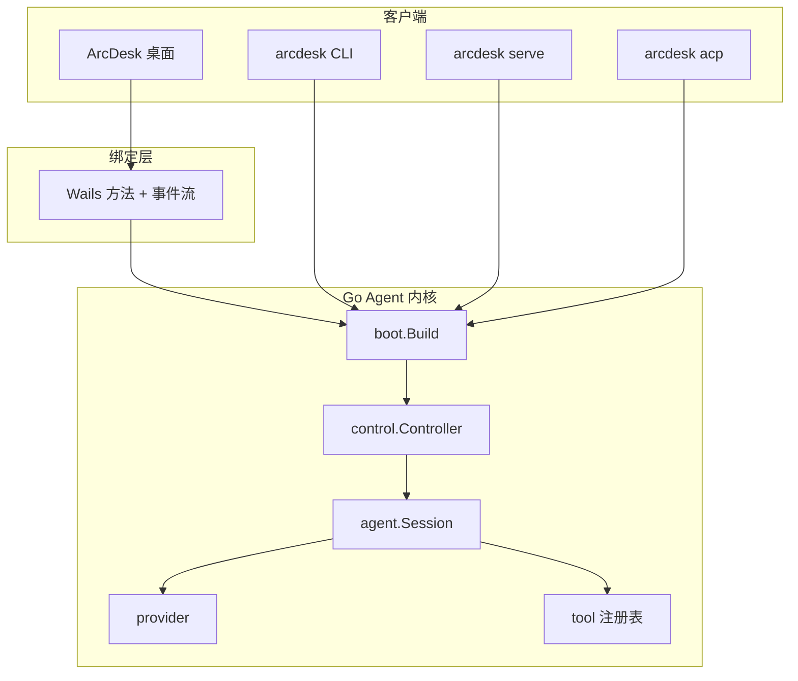

<p align="center">
  
</p>

<h1 align="center">ArcDesk</h1>

<p align="center">
  <strong>开源 DeepSeek 桌面 Coding Agent — Wails 独立窗口</strong><br/>
  Diff 审批 · 经验库 · MCP/Skills · 沙盒预览 · 三档模式 · 内置工作台 · 远程定时 · 长会话优化
</p>

<!-- 荣誉勋章 · shields.io（与 Reasonix 同款；右侧为版本 / MIT / star 数 / issue 数） -->
<p align="center">
  <a href="https://github.com/P1ouson/deepseek-ArcDesk/releases">
    
  </a>
  <a href="./LICENSE">
    
  </a>
  <a href="https://github.com/P1ouson/deepseek-ArcDesk/stargazers">
    
  </a>
  <a href="https://github.com/P1ouson/deepseek-ArcDesk/issues">
    
  </a>
</p>

<p align="center">
  <a href="https://github.com/P1ouson/deepseek-ArcDesk/releases"><strong>⬇ 下载桌面版</strong></a>
  &nbsp;·&nbsp;
  <a href="#核心特色">特色</a>
  &nbsp;·&nbsp;
  <a href="#预览">预览</a>
  &nbsp;·&nbsp;
  <a href="#描述">描述</a>
  &nbsp;·&nbsp;
  <a href="#技术栈">技术栈</a>
  &nbsp;·&nbsp;
  <a href="#使用前须知">须知</a>
  &nbsp;·&nbsp;
  <a href="#安装">安装</a>
  &nbsp;·&nbsp;
  <a href="#快速开始">快速开始</a>
  &nbsp;·&nbsp;
  <a href="#参与贡献">贡献</a>
  &nbsp;·&nbsp;
  <a href="README.en.md">English</a>
</p>

<br/>

## 核心特色

| 特色 | 说明 |
|------|------|
| **Diff + 审批** | 写文件 / bash / MCP 逐步确认；编辑类变更在侧栏 Diff 审阅（对话流点文件名查看）。 |
| **Knowledge Studio** | 项目踩坑经验库（Failure Memory）：捕获、检索、确认入库，不靠裸扫仓库。 |
| **MCP + Skills** | MCP 市场与安装向导；skills.sh 装技能；内置 explore / research / review / security-review；`.mcp.json` 按项目信任。 |
| **沙盒 + Web 预览** | `project-sandbox.json` 界定 bash / 预览 host·端口白名单；dev server iframe 沙箱预览。 |
| **三档运行模式** | Auto / Plan（只读→计划批准）/ YOLO（会话内自动审批）。 |
| **内置工作台** | 集成终端、浏览器预览、Git / 变更面板、多 Tab 工作区。 |
| **定时 + 手机远程** | 到期自动开聊；扫码 / 局域网 / Cloudflare 连桌面 Agent（含远程审批）。 |
| **DeepSeek 长会话** | 前缀缓存与费用估算可见；三级压缩 + `/compact`；`ARCDESK.md` 记忆层 + Failure Memory。 |
| **桌面原生** | Wails 独立窗口，非 IDE 分支、非浏览器 Tab；CLI 与桌面同源 Agent 内核。 |

<br/>

## 预览

<p align="center">
  
</p>

<p align="center"><sub>导入工作区 → Agent 工具链执行 → 侧栏 Diff 审阅 · 逐步审批</sub></p>

<p align="center">
  <a href="https://github.com/P1ouson/deepseek-ArcDesk/releases/latest/download/arcdesk-desktop-windows-amd64-installer.exe"><strong>⬇ Windows</strong></a>
  &nbsp;·&nbsp;
  <a href="https://github.com/P1ouson/deepseek-ArcDesk/releases">全部发布</a>
</p>

<br/>

## 描述

**ArcDesk** 是面向 DeepSeek 的**开源桌面 Coding Agent**：在 Wails 独立窗口里完成「对话 → 工具 → 侧栏 Diff → 审批」，长会话侧有前缀缓存、分级压缩与费用可见。

除 Agent 内核外，ArcDesk 自带完整**桌面工作台** — 经验库、MCP/Skills 市场、项目沙盒与 Web 预览、Auto / Plan / YOLO 三档模式、终端与 Git 面板、手机远程与定时任务；CLI `arcdesk chat` / `run` / `serve` 与桌面共用同一套 Go 内核。

<br/>

## 技术栈

| 分层 | 技术 |
|------|------|
| **桌面 UI** | React 18 · TypeScript · Vite · xterm.js · highlight.js · react-markdown |
| **桌面框架** | [Wails v2](https://wails.io/) · WebView2 / WebKitGTK |
| **Agent 内核** | Go 1.25+ · `control.Controller`（桌面 / CLI / HTTP 共用） |
| **CLI** | Bubble Tea TUI · 静态二进制（`CGO_ENABLED=0`） |
| **配置** | TOML（`arcdesk.toml` · `~/.config/arcdesk/config.toml` · `.mcp.json`） |
| **协议与集成** | MCP（stdio + HTTP）· Skills · Hooks · ACP · HTTP/SSE `serve` |
| **构建与发布** | make · pnpm · goreleaser（CLI 多平台）· Wails build · NSIS（Windows 桌面安装包） |

<br/>

## 使用前须知

> 上手前建议先读，避免首次安装与配置上的常见问题。

### 首次安装（Windows）

| 须知 | 说明 |
|------|------|
| **非 DeepSeek 官方产品** | ArcDesk 为独立 MIT 开源项目；模型推理按 API 用量计费 |
| **首次启动** | 安装包尚未 Authenticode 签名，可能出现 SmartScreen 提示 → 更多信息 → 仍要运行；缺失时会自动下载 WebView2，若窗口空白请手动安装 [WebView2](https://developer.microsoft.com/microsoft-edge/webview2/) |

### 使用与配置

| 须知 | 说明 |
|------|------|
| **API 与密钥** | 密钥保存在本地凭证存储或环境变量，勿写入 `arcdesk.toml` 并提交 Git；自定义 Base URL 须以 `/v1` 结尾，中转站填控制台「令牌」且勿带 `Bearer` 前缀 |
| **MCP 默认隔离** | 项目 `.mcp.json` 中的服务器需在桌面 UI **按项目显式信任**后才加载 |
| **YOLO 模式** | 全自动模式会跳过逐步审批；使用前请了解项目沙盒配置（`project-sandbox.json`） |
| **远程连接** | 手机远程、局域网与 Cloudflare 穿透会扩大网络暴露面；仅在可信环境启用 |

**故障排查：**

| 现象 | 处理 |
|------|------|
| MCP 未加载 | 桌面 UI 信任项目 MCP；检查 `.mcp.json` 与 `arcdesk.toml` |
| API 401 / 密钥无效 | 核对 Base URL（`/v1`）、密钥来源与 Bearer 前缀；中转站检查余额与令牌状态 |

<br/>

## 安装

### 桌面版（推荐）

当前 [Releases](https://github.com/P1ouson/deepseek-ArcDesk/releases) **仅提供 Windows (amd64) NSIS 安装包**（非 Source code zip）。macOS / Linux 预编译包暂未发布，需从源码构建（见「源码构建桌面」）。

| 平台 | 安装包 |
|------|--------|
| **Windows** | [`arcdesk-desktop-windows-amd64-installer.exe`](https://github.com/P1ouson/deepseek-ArcDesk/releases/latest/download/arcdesk-desktop-windows-amd64-installer.exe) |

### CLI（源码构建）

**依赖：** Go 1.25+、Git

```bash
git clone https://github.com/P1ouson/deepseek-ArcDesk.git
cd deepseek-ArcDesk
make build          # 输出 bin/ARCDESK（Windows: ARCDESK.exe）
```

### 源码构建桌面

**依赖：** Go · Node.js · pnpm · Wails CLI · 平台 WebView 库

```bash
cd desktop
wails dev            # 开发热重载
wails build          # → build/bin/arcdesk-desktop
```

Windows 本地快速构建（跳过 NSIS 安装包，在**仓库根目录**执行）：

```powershell
powershell -File desktop/build-dev.ps1
```

> `build-dev.ps1` 内前端步骤当前使用 `npm run build`；日常前端开发亦可 `cd desktop/frontend && pnpm install && pnpm dev`。

Windows NSIS 安装包：`desktop/scripts/build-windows-installer.ps1`（详见 [`desktop/README.md`](desktop/README.md)）。

<br/>

## 快速开始

### 桌面版

1. 安装 **Windows** 安装包并启动 **ArcDesk**（macOS / Linux 见上方「源码构建桌面」）
2. 在设置中粘贴 [DeepSeek API Key](https://platform.deepseek.com/)（保存在本地凭证存储）
3. **导入工作区** — 选择项目文件夹
4. 在输入框描述任务，例如：`阅读 README 并列出主要模块`
5. 对工具调用（写文件、bash 等）在审批 UI 中确认

默认 **Auto** 模式逐步审批；**Plan** / **YOLO** 可在输入区 **Shift+Tab** 切换。

### CLI

```bash
export DEEPSEEK_API_KEY=sk-...        # Linux / macOS；或 ./bin/ARCDESK setup 交互写入
./bin/ARCDESK setup                   # 生成 ~/.config/arcdesk/config.toml

cd your-project
./bin/ARCDESK chat                    # 交互 TUI
./bin/ARCDESK run "解释这个仓库的目录结构"
```

Windows PowerShell：

```powershell
$env:DEEPSEEK_API_KEY = "sk-..."
.\bin\ARCDESK.exe setup
.\bin\ARCDESK.exe chat
```

### 最小配置示例

```toml
# arcdesk.toml
default_model = "deepseek"

[[providers]]
name        = "deepseek"
kind        = "openai"
base_url    = "https://api.deepseek.com"
models      = ["deepseek-v4-flash", "deepseek-v4-pro"]
default     = "deepseek-v4-flash"
api_key_env = "DEEPSEEK_API_KEY"
context_window = 1000000

[agent]
max_steps = 25
compact_ratio = 0.8

[permissions]
mode  = "ask"
deny  = ["bash(rm -rf*)"]
```

完整 schema → [`docs/SPEC.md`](docs/SPEC.md) · 完整示例 → [`docs/examples/arcdesk.example.toml`](docs/examples/arcdesk.example.toml)

<br/>

## 项目结构

```
deepseek-ArcDesk/
├── cmd/arcdesk/              # CLI 入口（chat / run / setup / serve / acp …）
├── internal/
│   ├── boot/                 # 组装 control.Controller
│   ├── agent/                # Agent 循环与会话
│   ├── cli/                  # TUI 与子命令
│   ├── control/              # 传输无关控制器（桌面 / CLI / HTTP 共用）
│   ├── config/               # TOML 配置加载
│   ├── provider/             # 模型后端
│   ├── tool/builtin/         # 内置工具
│   ├── plugin/               # MCP 客户端
│   ├── skill/                # Skills 与子 Agent
│   ├── serve/                # HTTP/SSE 服务
│   ├── hook/                 # Hooks
│   └── knowledge/            # Knowledge Studio / Failure Memory
├── desktop/                  # Wails 桌面应用（独立 Go 模块）
│   ├── app.go                # Go ↔ React 绑定
│   └── frontend/             # React UI
├── docs/                     # SPEC、示例配置、截图、变更记录
├── Makefile
└── README.md
```

完整目录说明见 [`CONTRIBUTING.md`](CONTRIBUTING.md#project-structure)。

<br/>

## 架构概览

桌面、CLI、HTTP 与 ACP 共用同一 Agent 内核；桌面通过 Wails 直接绑定 `control.Controller` 并订阅事件流，不经 HTTP。



<br/>

## 参与贡献

欢迎贡献！细则见 [`CONTRIBUTING.md`](CONTRIBUTING.md)。

```bash
git clone https://github.com/P1ouson/deepseek-ArcDesk.git
cd deepseek-ArcDesk
make check-toolchain
make build && make test && make vet
```

**Commit 规范：** [Conventional Commits](https://www.conventionalcommits.org/)（如 `feat(desktop): …` · `fix: …` · `docs: …`）

**PR 流程：**

1. Fork [`P1ouson/deepseek-ArcDesk`](https://github.com/P1ouson/deepseek-ArcDesk)，从 `main` 切分支
2. 行为变更需附测试；`make test` 与 `make vet` 通过
3. 桌面 UI 变更：`desktop/frontend` 通过 `pnpm exec tsc --noEmit`；建议 `cd desktop && go test ./...`
4. 提交前可运行 `make fmt`；可选 `make hooks` 安装 pre-push vet

**安全漏洞：** 请勿公开 Issue，见 [`SECURITY.md`](SECURITY.md)。

<br/>

## 相关文档

| 文档 | 说明 |
|------|------|
| [`CONTRIBUTING.md`](CONTRIBUTING.md) | 贡献指南、完整目录、开发流程 |
| [`docs/README.md`](docs/README.md) | 文档索引 |
| [`docs/SPEC.md`](docs/SPEC.md) | 配置 schema、工具、MCP、权限 |
| [`docs/CHANGELOG.md`](docs/CHANGELOG.md) | 版本变更 |
| [`docs/MIGRATING.md`](docs/MIGRATING.md) | 从 Reasonix / 旧版迁移 |
| [`docs/maturity/`](docs/maturity/) | P0–P2 能力清单 |
| [`docs/examples/arcdesk.example.toml`](docs/examples/arcdesk.example.toml) | 完整配置示例 |
| [`docs/examples/env.example`](docs/examples/env.example) | 环境变量示例 |
| [`desktop/README.md`](desktop/README.md) | 桌面构建与开发 |
| [`SECURITY.md`](SECURITY.md) | 安全模型与漏洞报告 |

<br/>

## 开源协议

[MIT](LICENSE) © ArcDesk contributors

<br/>

## Star 趋势

<a href="https://www.star-history.com/#P1ouson/deepseek-ArcDesk&Date">
  <picture>
    <source media="(prefers-color-scheme: dark)" srcset="https://api.star-history.com/svg?repos=P1ouson/deepseek-ArcDesk&type=Date&theme=dark" />
    
  </picture>
</a>

---

<p align="center">
  <sub>如果 ArcDesk 对你有帮助，欢迎 <a href="https://github.com/P1ouson/deepseek-ArcDesk">Star ⭐</a> 支持项目</sub>
</p>
