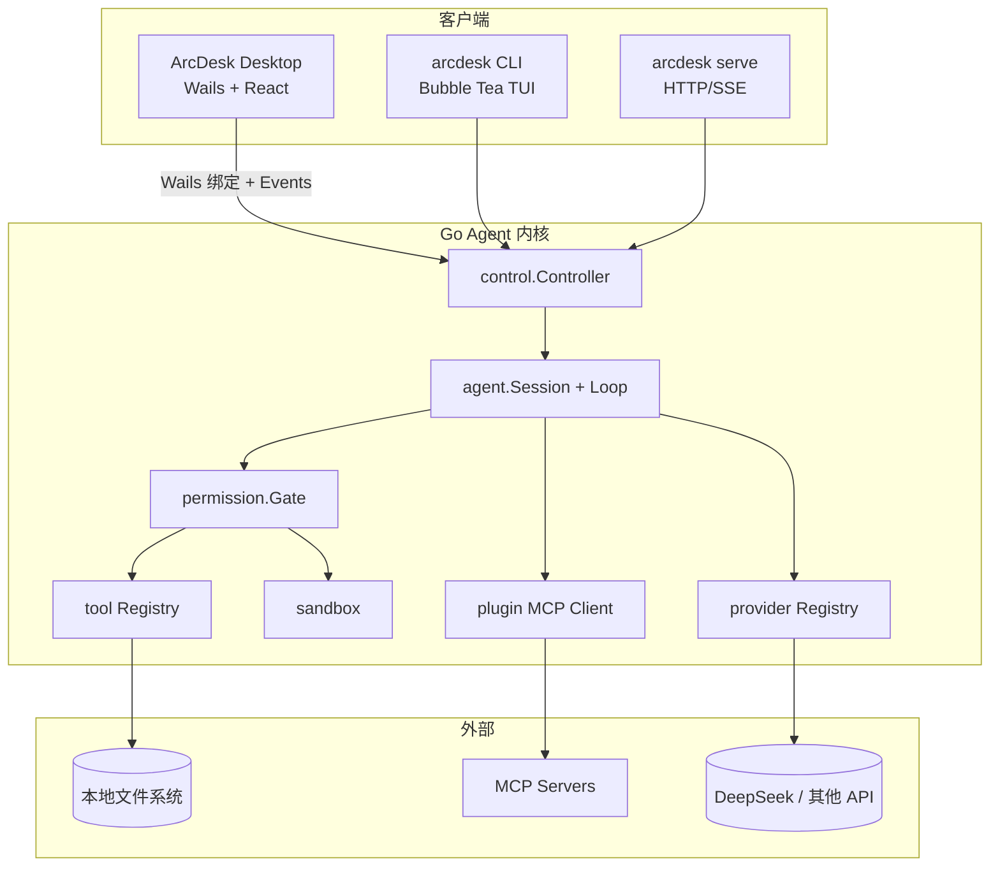

<p align="center">
  
</p>

<p align="center">
  <strong>本地 DeepSeek 桌面 Coding Agent — 独立窗口完成读代码、改文件、跑命令</strong><br/>
  不绑浏览器标签页 · 工具调用需审批 · MCP / Skills · 针对 DeepSeek 长会话成本优化
</p>

<p align="center">
  <a href="https://github.com/P1ouson/deepseek-ArcDesk/releases"></a>
  <a href="./LICENSE"></a>
  <a href="https://github.com/P1ouson/deepseek-ArcDesk/stargazers"></a>
  <a href="https://github.com/P1ouson/deepseek-ArcDesk/issues"></a>
</p>

<p align="center">
  <a href="https://github.com/P1ouson/deepseek-ArcDesk/releases"><strong>⬇ 下载桌面版</strong></a>
  &nbsp;·&nbsp;
  <a href="#30-秒预览">预览</a>
  &nbsp;·&nbsp;
  <a href="#和谁不一样">对比</a>
  &nbsp;·&nbsp;
  <a href="#快速开始">快速开始</a>
  &nbsp;·&nbsp;
  <a href="#桌面亮点">桌面亮点</a>
  &nbsp;·&nbsp;
  <a href="#内核与优化">内核优化</a>
  &nbsp;·&nbsp;
  <a href="#功能">功能</a>
  &nbsp;·&nbsp;
  <a href="https://github.com/P1ouson/deepseek-ArcDesk/blob/main/docs/SPEC.md">规格文档</a>
  &nbsp;·&nbsp;
  <a href="https://github.com/P1ouson/deepseek-ArcDesk/blob/main/SECURITY.md">安全说明</a>
  &nbsp;·&nbsp;
  <a href="README.en.md">English</a>
</p>

<br/>

## 30 秒预览 {#30-秒预览}

<p align="center">
  <a href="https://github.com/P1ouson/deepseek-ArcDesk/releases">
    
  </a>
</p>
<p align="center"><sub>导入项目 → 代码工作区欢迎页 → 一键卡片发起 Agent 任务 · <a href="#更多界面">静态截图</a></sub></p>

<p align="center">
  <a href="https://github.com/P1ouson/deepseek-ArcDesk/releases/latest/download/arcdesk-desktop-windows-amd64-installer.exe"><strong>⬇ Windows</strong></a>
  &nbsp;·&nbsp;
  <a href="https://github.com/P1ouson/deepseek-ArcDesk/releases/latest/download/arcdesk-desktop-darwin-universal.dmg"><strong>macOS</strong></a>
  &nbsp;·&nbsp;
  <a href="https://github.com/P1ouson/deepseek-ArcDesk/releases/latest/download/arcdesk-desktop-linux-amd64-installer.tar.gz"><strong>Linux</strong></a>
  &nbsp;·&nbsp;
  <a href="https://github.com/P1ouson/deepseek-ArcDesk/releases">全部 Release</a>
</p>

> **首次安装须知（请先看）**
>
> - **ArcDesk 是独立 MIT 开源项目，并非 DeepSeek 官方产品。** 模型推理按 API 用量计费。
> - 当前安装包**尚未** Apple 公证 / Windows Authenticode 签名。macOS 可能提示「已损坏」；Windows 可能出现 SmartScreen — 见 [故障排查](#故障排查)。
> - Windows 安装程序会在缺失时**自动下载 WebView2**（约数 MB，属正常行为）。
> - 请选择默认路径 **`%LOCALAPPDATA%\Programs\ArcDesk`** 或新建空文件夹安装；**不要**装到含 `.git` / 源码的开发目录（卸载时可能残留文件）。

<br/>

## 和谁不一样 {#和谁不一样}

| | **ArcDesk** | **网页版 DeepSeek** | **Cursor** | **Chatbox 等客户端** |
|---|:---:|:---:|:---:|:---:|
| **形态** | 原生桌面 + CLI | 浏览器标签 | IDE 分支 | 多为 Electron 聊天壳 |
| **Agent 工作流** | 读文件 / bash / Diff / 审批 | 以对话为主 | ✅ 深度 IDE 集成 | 视产品而定 |
| **DeepSeek 长会话成本** | 前缀缓存 + 压缩策略 | 无专门优化 | 多模型订阅 | 通常无 |
| **MCP + 项目级信任** | ✅ | ❌ | ✅ | 部分 |
| **开源可审计** | MIT | ❌ | ❌ | 视项目 |
| **独立窗口（不绑 IDE）** | ✅ 默认 | ❌ | 在 IDE 内 | ✅ |

与 Cursor 同类的是 **Agent 循环**（对话 → 工具 → Diff → 审批），不是完整 IDE 替代品。可与 VS Code、JetBrains 等并行使用。

<br/>

## 更多界面 {#更多界面}

<p align="center">
  
</p>
<p align="center"><sub><strong>代码工作区</strong> — 项目导览 / 最近变更 / 定位逻辑 · auto / plan / yolo · 底部 DeepSeek 用量</sub></p>

侧栏另含 **写作 · 扩展（Skills / MCP）· 定时 · 连接（手机远程）· 设置**。完整能力见 [桌面亮点](#桌面亮点)；补截图见 [`docs/screenshots/README.md`](docs/screenshots/README.md)。

<br/>

## 桌面亮点

ArcDesk 桌面版不是「包一层 Web UI」——**自研 Go Agent 内核**通过 Wails **直接绑定** React（`control.Controller` → 事件流），无额外 HTTP 中转。以下能力在 CLI 中不存在或体验不同，是桌面版的主要差异：

| 亮点 | 做什么 | 说明 |
|------|--------|------|
| **代码工作区** | 项目级 Agent 会话 | 多标签并行/切换工作区；标签呼吸灯（绿=就绪、黄=运行）；快捷卡片一键发起任务；**auto / plan / yolo** 三档；底部与右侧概览显示 Token / 缓存用量 |
| **写作工作区** | 文稿 + Agent 协作 | 独立写作模式，按文件夹组织文稿；可联动 **Skills**（如 copywriting）做营销/文档类任务，与代码会话隔离 |
| **Agent 扩展** | Skills + MCP | 内置 explore / research / review / security-review 等子 Agent Skills；支持从文件夹加载自定义 Skill；MCP 外部工具（stdio / HTTP）按项目信任加载 |
| **定时任务** | 无人值守 Agent | 后台每 30 秒检查到期任务，自动开启新对话并发送预设 Prompt；可绑定工作区根目录与模型，支持每日等调度类型 |
| **手机远程连接** | 扫码配对 · 局域网 · 穿透 | 手机浏览器扫码配对后远程查看/驱动桌面 Agent；同 Wi‑Fi 可走局域网；外网可用 **Cloudflare 一键穿透**（空闲 10 分钟自动停止）；移动端会话跟随桌面当前 Tab 与模型 |
| **沙盒 Browser** | 多标签 iframe 预览 | 侧栏 **Browser** 多标签沙盒预览 dev server；地址栏可改、**适应面板**缩放；默认更宽，**展开预览**占半窗；**Preview** 面板预览工作区 HTML/SVG |
| **项目沙盒** | YOLO 前置安全边界 | 按项目配置 bash 约束、网络、可写目录与预览 URL 策略；YOLO（全自动工具）模式需先完成沙盒配置 |
| **集成终端** | 多 Tab PTY | 工作台内嵌 xterm.js 终端，支持多标签；Shell 可在设置中选择 PowerShell / cmd / Git Bash / WSL |
| **会话概览** | 右侧 Context 面板 | 上下文占用、模型/模式、费用与余额；**Token 用量**（输入/输出/缓存命中·未命中）；Git 分支与改动预览 |
| **内联 Diff + 工具审批** | 可见、可拒 | Agent 写文件 / 跑 bash / 调 MCP 时弹出原生审批；变更以 Diff 形式展示后再应用 |
| **代码审查面板** | 一键 Review | 内置标准 / 安全审查模式，可按 Git 范围或会话改动调用 `review` / `security_review` 子 Agent |
| **记忆库** | 跨会话项目记忆 | 管理 `ARCDESK.md` 层级记忆，长会话前缀稳定、减少重复交代背景 |
| **新建需求（SDD）** | 结构化需求 → Agent | 从侧栏发起结构化需求单，逐步确认后交给 Agent 执行 |
| **Git / GitHub CLI** | PR 与合并偏好 | 设置中配置 PR 合并方式、commit/PR 说明模板；检测 `gh` CLI 状态 |

<p align="center"><sub>侧栏六页见<a href="#更多界面">更多界面</a>；完整能力见 <a href="#桌面亮点">桌面亮点</a></sub></p>

<br/>

## 内核与优化

ArcDesk 使用 **独立实现的 Go Agent 内核**（`internal/agent` + `internal/control`），从 1.0 起为单仓库自研代码线，**不是**在 Reasonix 或其他项目上套壳优化。CLI 与桌面共享同一内核；桌面额外提供 Wails 绑定层与原生 UX。

### 内核层优化（CLI + 桌面共用）

| 优化点 | 做法 | 效果 |
|--------|------|------|
| **单二进制分发** | `CGO_ENABLED=0` 静态编译，Provider / Tool 注册表驱动 | 跨平台一条命令构建，无 Node 运行时依赖 |
| **DeepSeek 长会话经济学** | 前缀缓存导向的 prompt 结构、`compact_ratio` 渐进压缩、`ARCDESK.md` 记忆折叠进稳定前缀 | 长任务下 cache hit 比例更高，底部状态栏可见压缩率与命中情况 |
| **传输无关控制器** | `control.Controller` 统一装配 Agent、权限、MCP、Provider | 桌面 Wails 绑定、CLI TUI、`serve` HTTP/SSE 共用一套逻辑 |
| **权限 + 沙盒双层** | `[permissions]` allow/ask/deny + 工作区写入根 + macOS Seatbelt bash | 策略与强制执行分离，默认 ask 而非静默改盘 |
| **MCP 一等公民** | stdio / Streamable HTTP；`.mcp.json` 合并；项目级信任隔离 | 外部工具可插拔，桌面 UI 可审计来源 |
| **子 Agent Skills** | explore / research / review / security_review 隔离上下文 | 主会话不被子任务撑爆 |
| **CodeGraph 替代 embedding** | tree-sitter 符号图本地索引，按需拉取二进制 | 无向量服务成本，代码检索可离线 |
| **多编码文件读写** | GBK / GB18030 等检测与回写保留原编码 | Windows 中文代码库不再误报 binary |
| **Plan + 证据链** | `complete_step` 分步签收、auto-plan 可选 | 长任务可拆步、可追踪 |

### 桌面层增量（Wails 壳）

| 优化点 | 做法 | 效果 |
|--------|------|------|
| **零 HTTP 跳板的 UI 绑定** | Go `App` 方法 + `EventsEmit` 直推 React | Agent 流式输出延迟更低，状态与审批与内核同步 |
| **手机远程连接** | 局域网 HTTP + Cloudflare 快速穿透 + 移动 Web UI（`mobile_page.html`） | 外网扫码配对；空闲自动停穿透；会话跟随桌面 Tab |
| **写作工作区** | 独立文稿树 + 写作助手（摘要 / 润色 / 校对）+ Skills 自动启用 | 文档类任务与代码会话分离，可插入文稿 |
| **沙盒 Browser** | 多标签 + 适应面板缩放 + 半窗展开 | 改前端时同屏看 dev server；侧栏可放大至窗口一半 |
| **定时 Agent** | 后台 30s tick，`scheduled-tasks.json` 持久化 | 到点自动开聊并发 Prompt |
| **项目沙盒向导** | `project-sandbox.json` 约束 bash / 网络 / 预览 URL | YOLO 全自动前必须划边界 |
| **原生确认链** | 凭证、穿透、外链预览、高危 shell 走 OS 级确认 | 降低误触与供应链风险 |
| **签名更新通道** | Windows / Linux minisign + SHA256 校验后原地更新 | 官方 Release 可验证、可自动升级 |

> 从旧版 Reasonix 配置迁移见 [`docs/MIGRATING.md`](https://github.com/P1ouson/deepseek-ArcDesk/blob/main/docs/MIGRATING.md)，仅为兼容导入，不代表内核同源。

<br/>

## 功能

| 能力 | 说明 | 用户价值 |
|------|------|----------|
| **原生桌面应用** | Wails + React 壳，直接绑定 Go Agent 内核，无 HTTP 中转 | 独立窗口完成读代码、改文件、跑命令，不依赖编辑器插件 |
| **Agent 工具链** | 内置 `read_file` / `write_file` / `edit_file` / `multi_edit` / `bash` / `grep` / `glob` / `ls` / `web_fetch` / `todo_write` 等 | Agent 可直接操作真实代码库，而非仅生成文本 |
| **DeepSeek 长会话** | 前缀缓存导向的 prompt 结构与 `compact_ratio` 压缩策略 | 长任务下控制 Token 与 API 成本 |
| **权限与沙盒** | `[permissions]` 规则（allow / ask / deny）+ 工作区写入限制 + macOS Seatbelt bash 沙盒 | 比「静默执行工具」更安全，适合本地代码库 |
| **MCP 集成** | stdio 与 Streamable HTTP 传输；读取 `arcdesk.toml` 与 `.mcp.json` | 复用 Claude Code 生态的 MCP 服务器；项目级信任 / 隔离 |
| **Skills 与子 Agent** | 内置 explore / research / review / security_review；支持自定义 `SKILL.md` | 复杂任务拆给专用子 Agent，主会话保持上下文干净 |
| **内联 Diff** | 桌面 UI 展示文件变更，支持审阅后再应用 | 改动可见、可撤销，降低「Agent 乱改代码」风险 |
| **多模式工作区** | 代码、写作、连接、定时、扩展、设置 | 同一 Agent 内核，按任务切换界面，不必开多个工具 |
| **Web 实时预览** | iframe + 项目 URL 白名单 + 可达性探测 | 改前端代码时在桌面内直接看 dev server 效果，不必切浏览器 |
| **手机远程连接** | 局域网配对 + Cloudflare 穿透 + 移动 Web UI | 离开工位也能查看 Agent 进度；穿透默认空闲自动关闭 |
| **定时 Agent** | 后台 scheduler，到期自动 `run` | 日报、巡检、依赖更新等重复任务无人值守 |
| **项目沙盒** | 每项目 `project-sandbox.json` + YOLO 门槛 | 高信任模式前先划边界，预览 URL 也受沙盒策略约束 |
| **集成终端** | 多 Tab 原生 PTY（xterm.js） | Agent 跑命令后可在同一窗口跟进输出 |
| **代码审查** | 桌面内建 Review 面板 + 子 Agent | 提交前快速过一遍 diff，支持安全审查模式 |
| **CodeGraph** | tree-sitter 符号 / 调用图 MCP（可选，`codegraph_*` 工具） | 无 embedding 服务的代码检索，本地索引 |
| **CLI 同源内核** | `arcdesk chat` / `run` / `serve` / `acp` 与桌面共享 `control.Controller` | 终端、HTTP、桌面三种入口，配置一致 |
| **多模型 Provider** | OpenAI 兼容（DeepSeek、MiMo 等）与 Anthropic Messages API | DeepSeek 优先，但不锁死单一厂商 |
| **自动更新** | Windows / Linux 校验 minisign + SHA256 后原地更新 | 安全获取新版本，无需手动追踪 Release |

<br/>

## 为什么做 ArcDesk

**问题：** 许多开发者已在用 Cursor、Cline 或「网页 ChatGPT + 手工复制」做 AI 辅助编码，但常见痛点是：

- 长会话 API 成本高，且缺少针对 DeepSeek 前缀缓存的会话设计
- 编辑器插件绑定了 IDE，难以获得独立、本地优先的 Agent 窗口
- 工具执行缺少细粒度审批，MCP 来源难以按项目信任
- 闭源产品难以审计 Agent 行为与数据路径

**ArcDesk 的定位：** 开源、桌面优先的 **Coding Agent** —— 提供 Cursor 风格的 Agent 循环，但不是 VS Code 分支，也不试图替换专业 IDE。

**与同类工具的差异：**

| 对比 | ArcDesk | Cursor | Cline / Roo | Claude Code |
|------|---------|--------|-------------|-------------|
| 形态 | 原生桌面 + CLI | IDE 分支 | VS Code 扩展 | CLI / 插件为主 |
| 开源 | MIT | 闭源 | 开源 | 闭源 |
| DeepSeek 成本优化 | 会话 / 缓存导向 | 多模型订阅 | 取决于后端 | Claude 生态 |
| 独立桌面 | ✅ 默认路径 | ✅（IDE 内） | ❌ | 部分 |
| MCP + 项目级信任 | ✅ | ✅ | ✅ | ✅ |

**适合谁：**

- 独立开发者、开源维护者、对 API 成本敏感的工程师
- 已有 VS Code / JetBrains / 终端工作流，想要**独立 Agent 窗口**的人
- 需要本地控制、工具审批、MCP 可审计流程的用户

**可能不适合：**

- 需要完整 IDE + 扩展生态一站式替代的人
- 只要单行补全、不需要 Agent 工作流的人
- 需要企业级云端协作 / 托管治理的团队
- 不愿配置模型 API Key、期望推理完全免费的用户

<br/>

## 技术栈

| 分层 | 技术 |
|------|------|
| **Frontend（桌面 UI）** | React 18 · TypeScript · Vite · xterm.js · react-markdown · highlight.js |
| **Desktop Shell** | [Wails v2](https://wails.io/)（WebView2 / WebKitGTK）· Go CGO |
| **Backend / Agent 内核** | Go 1.25+ · 单静态二进制（CLI `CGO_ENABLED=0`） |
| **Database** | 无服务端 DB；CodeGraph 使用本地 SQLite 索引；会话 / 检查点存于本地文件 |
| **AI / Model** | Provider 抽象层；内置 `openai`（DeepSeek、MiMo 等兼容端点）、`anthropic` |
| **协议与扩展** | MCP（stdio + HTTP）· Skills · Hooks · ACP · HTTP/SSE `serve` |
| **Infrastructure** | GitHub Actions 构建 · minisign 签名 · R2 CDN 更新镜像 |
| **Build** | `make` · `goreleaser` · `wails build` · pnpm（前端）· NSIS（Windows 安装包） |

<br/>

## 项目结构

```
deepseek-ArcDesk/
├── cmd/
│   ├── arcdesk/                 # CLI 入口（chat / run / setup / serve …）
│   ├── arcdesk-plugin-example/  # MCP stdio 插件示例
│   ├── arcdesk-relay/           # 远程 relay 组件
│   └── e2ebench/                # 端到端基准
├── internal/
│   ├── agent/                   # Agent 循环与会话
│   ├── cli/                     # 终端 TUI 与子命令
│   ├── control/                 # 传输无关的控制器（桌面 / CLI / HTTP 共用）
│   ├── config/                  # TOML 配置加载与迁移
│   ├── provider/                # 模型后端（openai / anthropic）
│   ├── tool/builtin/            # 内置工具实现
│   ├── plugin/                  # MCP 客户端
│   ├── permission/              # allow / ask / deny 策略
│   ├── sandbox/                 # 工作区与 bash 沙盒
│   ├── skill/                   # Skills 与子 Agent
│   ├── codegraph/               # CodeGraph MCP 集成
│   ├── memory/                  # ARCDESK.md 层级记忆
│   └── serve/                   # HTTP/SSE 服务
├── desktop/                     # Wails 桌面应用（独立 Go module）
│   ├── app.go                   # Go ↔ React 绑定与事件流
│   └── frontend/                # React UI
├── docs/                        # SPEC、迁移指南、截图
├── npm/arcdesk/                 # npm 包装器（可选分发 CLI 二进制）
├── benchmarks/                  # 性能与对齐测试
├── arcdesk.example.toml         # 配置示例
├── Makefile                     # CLI 构建 / 测试 / 交叉编译
└── SECURITY.md                  # 安全模型与漏洞报告
```

<br/>

## 安装

### 方式一：桌面版（推荐）

支持 **Windows · macOS · Linux (amd64)**。从 [Releases](https://github.com/P1ouson/deepseek-ArcDesk/releases) 下载**安装包**（非 Source code zip）。

| 平台 | 安装包 | 说明 |
|------|--------|------|
| **Windows** | [`arcdesk-desktop-windows-amd64-installer.exe`](https://github.com/P1ouson/deepseek-ArcDesk/releases/latest/download/arcdesk-desktop-windows-amd64-installer.exe) | NSIS 向导， per-user，无需管理员；自动安装 WebView2（如缺失） |
| **macOS** | [`arcdesk-desktop-darwin-universal.dmg`](https://github.com/P1ouson/deepseek-ArcDesk/releases/latest/download/arcdesk-desktop-darwin-universal.dmg) | 拖入「应用程序」 |
| **Linux** | [`arcdesk-desktop-linux-amd64-installer.tar.gz`](https://github.com/P1ouson/deepseek-ArcDesk/releases/latest/download/arcdesk-desktop-linux-amd64-installer.tar.gz) | 解压后 `./install.sh` |

> 当前桌面构建**尚未** Apple 公证 / Windows Authenticode 签名。首次运行可能被系统拦截 — 见 [故障排查](#故障排查)。

### 方式二：CLI（源码构建）

**依赖：** Go 1.25+（与 `go.mod` 一致）、Git

```bash
git clone https://github.com/P1ouson/deepseek-ArcDesk.git
cd deepseek-ArcDesk
make build          # 输出 bin/ARCDESK（Windows: ARCDESK.exe）
```

### 方式三：CLI（npm，仓库内包装器）

仓库包含 `npm/arcdesk` 包装器，通过 optional dependencies 拉取各平台原生二进制。**npm 公开发布状态以 Release 说明为准**；若未发布，请使用源码构建。

```bash
cd npm/arcdesk && npm pack   # 本地安装需自行 link / pack
```

### 方式四：从源码构建桌面

**依赖：** Go · Node.js · pnpm · Wails CLI · 平台 WebView 库

```bash
# macOS：系统 WebKit
# Windows：WebView2 Runtime
# Linux：libgtk-3-dev + webkit2gtk（Fedora 40+ / Ubuntu 24.04+ 需 -tags webkit2_41）

cd desktop
wails dev            # 开发热重载
wails build          # → build/bin/arcdesk-desktop
# Windows 本地快速构建（跳过 NSIS 安装包）：
powershell -File build-dev.ps1
```

详见 [`desktop/README.md`](https://github.com/P1ouson/deepseek-ArcDesk/blob/main/desktop/README.md)。

<br/>

## 快速开始

### 桌面版 · 5 分钟

1. 安装对应平台安装包并启动 **ArcDesk**
2. 在设置中粘贴 [DeepSeek API Key](https://platform.deepseek.com/)（保存在本地凭证存储，不写入配置文件）
3. **导入工作区** — 选择项目文件夹
4. 在输入框描述任务，例如：`阅读 README 并列出主要模块`
5. 对工具调用（写文件、bash 等）在审批 UI 中确认

```bash
# Linux 一键示例
tar -xzf arcdesk-desktop-linux-amd64-installer.tar.gz
./install.sh
arcdesk-desktop
```

### CLI · 5 分钟

```bash
git clone https://github.com/P1ouson/deepseek-ArcDesk.git
cd deepseek-ArcDesk
make build

export DEEPSEEK_API_KEY=sk-...        # 或 arcdesk setup 交互写入
./bin/ARCDESK setup                   # 生成 ~/.config/arcdesk/config.toml

cd your-project
./bin/ARCDESK chat                    # 交互 TUI
# 或
./bin/ARCDESK run "解释这个仓库的目录结构"
```

> Windows PowerShell 将 `./bin/ARCDESK` 替换为 `.\bin\ARCDESK.exe`。

<br/>

## 配置

### 配置文件路径

| 文件 | 用途 |
|------|------|
| `./arcdesk.toml` | 项目级配置（Provider、MCP、权限规则） |
| `~/.config/arcdesk/config.toml` | 用户全局配置 |
| `~/.config/arcdesk/credentials` | API Key 等密钥（由 setup / 桌面 UI 写入） |
| `.mcp.json` | Claude Code 风格 MCP 声明（与 TOML 合并） |
| `.arcdesk/` | 项目元数据、Skills、Hooks 设置等 |

**加载顺序：** 命令行 flag > 项目 `arcdesk.toml` > 用户 `config.toml` > 内置默认值

可从 `~/.reasonix/` 非破坏性迁移旧配置，见 [`docs/MIGRATING.md`](https://github.com/P1ouson/deepseek-ArcDesk/blob/main/docs/MIGRATING.md)。

### 环境变量

| 变量 | 用途 | 默认值 |
|------|------|--------|
| `DEEPSEEK_API_KEY` | DeepSeek API 密钥 | 无（必填之一） |
| `MIMO_API_KEY` | 小米 MiMo API 密钥 | 无 |
| `ANTHROPIC_API_KEY` | Claude API 密钥 | 无 |
| `ARCDESK_LANG` | CLI / 模型 UI 语言（如 `zh`） | 空 = 自动检测 `$LANG` |
| `ARCDESK_THEME` | CLI 主题 `auto\|dark\|light` | 继承 `[ui].theme` |
| `ARCDESK_THEME_STYLE` | CLI 配色风格 | 继承 `[ui].theme_style` |
| `ARCDESK_PROXY_PASSWORD` | 网络代理密码（配置中 `${VAR}` 展开） | 无 |
| `ARCDESK_CODEGRAPH_BIN` | 指定 CodeGraph 二进制路径 | 自动缓存下载 |
| `WEBKIT_DISABLE_COMPOSITING_MODE` | Linux WebKit 渲染问题 workaround | 无 |

复制 [`.env.example`](https://github.com/P1ouson/deepseek-ArcDesk/blob/main/.env.example) 仅用于本地开发参考；**密钥应通过 setup 或桌面 UI 写入凭证存储，不要提交到 Git**。

### 最小配置示例

```toml
# arcdesk.toml
default_model = "deepseek"

[[providers]]
name        = "deepseek"
kind        = "openai"
base_url    = "https://api.deepseek.com"
models      = ["deepseek-v4-flash", "deepseek-v4-pro"]
default     = "deepseek-v4-flash"
api_key_env = "DEEPSEEK_API_KEY"
context_window = 1000000

[agent]
max_steps = 25
compact_ratio = 0.8

[permissions]
mode  = "ask"
deny  = ["bash(rm -rf*)"]
```

完整 schema → [`docs/SPEC.md`](https://github.com/P1ouson/deepseek-ArcDesk/blob/main/docs/SPEC.md) · 完整示例 → [`arcdesk.example.toml`](https://github.com/P1ouson/deepseek-ArcDesk/blob/main/arcdesk.example.toml)

<br/>

## 使用

### 典型桌面工作流

1. 导入项目工作区
2. 从左侧项目树**点击话题**打开顶部标签（可并行多个工作区/话题）
3. 选择模型与推理强度（Settings → Models）
4. 在**代码模式**下发任务；Agent 读取文件、调用工具
5. 在 Diff 面板审阅变更；批准或拒绝写操作
6. 右侧**概览**查看上下文占用、Token 与缓存命中情况
7. 在**扩展**页管理 Skills / MCP；首次加载项目 MCP 需显式信任
8. 可选：Plan 模式分步执行；YOLO 模式需先配置项目沙盒

### CLI 子命令

| 命令 | 说明 |
|------|------|
| `arcdesk chat` | 交互式终端 Agent（Bubble Tea TUI） |
| `arcdesk run "…"` | 单次非交互任务；支持 `--dir`、`--model`、`--metrics` |
| `arcdesk setup` | 配置向导：写入 config 与 API Key |
| `arcdesk init` | 初始化项目配置模板 |
| `arcdesk serve` | 启动 HTTP/SSE Agent 服务 |
| `arcdesk acp` | Agent Client Protocol 入口 |
| `arcdesk mcp` | MCP 服务器管理 |
| `arcdesk codegraph install` | 安装 / 缓存 CodeGraph 运行时 |
| `arcdesk doctor` | 诊断环境与配置（JSON 输出） |
| `arcdesk config auto-plan on\|off` | 切换自动 Plan 模式 |

TUI 内斜杠命令：`/model` · `/effort` · `/skills` · `/mcp` · `/compact` · `/hooks` 等。

### 常见场景

```bash
# 在指定目录运行一次性任务
arcdesk run --dir ./my-app "为 HTTP handler 添加单元测试"

# 导出 Token / 成本指标
arcdesk run --metrics /tmp/run-metrics.json "重构 config 包"

# 启动本地 HTTP 服务供其他工具调用
arcdesk serve --addr 127.0.0.1:8080
```

<br/>

## 架构

桌面、CLI 与 HTTP 服务共享同一 Agent 内核，UI 层仅负责绑定与事件渲染。



桌面通过 Wails 将 `control.Controller` 直接暴露给 React；CLI 与 `serve` 复用同一内核装配，仅传输层不同。

<br/>

## Roadmap

基于当前代码与 Release 说明的合理方向（非承诺）：

| 方向 | 现状 | 下一步 |
|------|------|--------|
| 桌面代码签名 | macOS / Windows 未公证 | Apple Developer ID + Authenticode |
| macOS 自动更新 | 仅提示手动下载 | 签名后启用原地更新 |
| Windows / Linux bash 沙盒 | macOS Seatbelt 最完整 | 增强 bubblewrap / Windows 约束 |
| npm CLI 分发 | 仓库内包装器已就绪 | 稳定 semver 发布到 npm |
| CodeGraph on Windows | 自动拉取未充分验证 | 完善 Windows 安装路径 |
| 文档与截图 | 持续更新 | 补全各侧栏实机截图 / CLI TUI |

<br/>

## FAQ

**ArcDesk 和 DeepSeek 是什么关系？**  
ArcDesk 是独立开源项目，使用 DeepSeek API（也支持其他 Provider）。不是 DeepSeek 官方产品。

**必须用桌面吗？**  
不必。桌面是默认推荐体验；`arcdesk chat` / `run` 提供同等 Agent 内核。

**免费吗？**  
软件 MIT 免费；模型推理按各 Provider 用量计费。

**必须用 DeepSeek 吗？**  
推荐。DeepSeek 的长会话与前缀缓存优化最完整；也支持 OpenAI 兼容端点与 Anthropic。

**和 Cursor 有什么区别？**  
ArcDesk 提供类似的 Agent 循环，但是独立桌面应用 + 开源 MIT，不是 VS Code 分支，也不包含 IDE 补全生态。

**MCP 安全吗？**  
项目根 `.mcp.json` 中的服务器默认**隔离**，需在桌面 UI 中按项目信任后才加载。详见 [`SECURITY.md`](https://github.com/P1ouson/deepseek-ArcDesk/blob/main/SECURITY.md)。

**配置文件叫 ARCDESK.toml 还是 arcdesk.toml？**  
当前 canonical 文件名为 **`arcdesk.toml`**。旧名会在迁移时自动处理。

**如何验证下载包？**  
Release 附带 minisign 签名与 SHA256。公钥 ID `AF12CA46F4A9EBB0`，见 [`SECURITY.md`](https://github.com/P1ouson/deepseek-ArcDesk/blob/main/SECURITY.md#verifying-downloads)。

**时间线里出现 `tool output truncated` 是什么？**  
不是报错。单次工具返回超过约 32KB 时，Agent 会保留首尾片段并提示用 `read_file` 的 `offset/limit` 分段继续读；长日志、大 `grep` 结果时较常见。

**后台 task 完成为什么有时才弹出？**  
v0.1.5 起，后台子任务（`run_in_background`）完成通知会在完成当下插入时间线；若仍看到延迟，请确认已更新到最新版。

<br/>

## 故障排查

| 现象 | 处理 |
|------|------|
| macOS「应用已损坏」 | `xattr -dr com.apple.quarantine /Applications/ArcDesk.app` |
| Windows SmartScreen | 更多信息 → 仍要运行；必要时安装 [WebView2](https://developer.microsoft.com/microsoft-edge/webview2/) |
| Windows 空白窗口 | 手动安装 WebView2 Runtime |
| Linux 找不到命令 | 将 `~/.local/bin` 加入 PATH，或从应用菜单启动 |
| Linux 空白 / 闪烁 | 安装 WebKitGTK 4.1；可试 `WEBKIT_DISABLE_COMPOSITING_MODE=1` |
| MCP 未加载 | 在桌面 UI 信任项目 MCP；检查 `.mcp.json` 与 `arcdesk.toml` |

<br/>

## Contributing

欢迎贡献。请先阅读 [`CONTRIBUTING.md`](https://github.com/P1ouson/deepseek-ArcDesk/blob/main/CONTRIBUTING.md)。

```bash
git clone https://github.com/P1ouson/deepseek-ArcDesk.git
cd deepseek-ArcDesk
make hooks          # 可选：安装 pre-push hook
make build && make test && make vet
```

**Commit 规范：** [Conventional Commits](https://www.conventionalcommits.org/)（如 `feat(desktop): …` · `fix: …` · `docs: …`）

**PR 流程：**

1. Fork 仓库，从 `main` 切分支
2. 行为变更需附测试
3. 确保 `make test` 与 `make vet` 通过
4. 桌面 UI 变更需在 `desktop/frontend` 通过 `pnpm exec tsc --noEmit`
5. 提交 PR 并描述动机与测试方式

**安全漏洞：** 请勿公开 Issue，见 [`SECURITY.md`](https://github.com/P1ouson/deepseek-ArcDesk/blob/main/SECURITY.md)。

<br/>

## License

[MIT](https://github.com/P1ouson/deepseek-ArcDesk/blob/main/LICENSE) © ArcDesk contributors

---

<p align="center">
  <sub>如果 ArcDesk 对你有帮助，欢迎 <a href="https://github.com/P1ouson/deepseek-ArcDesk">Star ⭐</a> 支持项目</sub>
</p>
